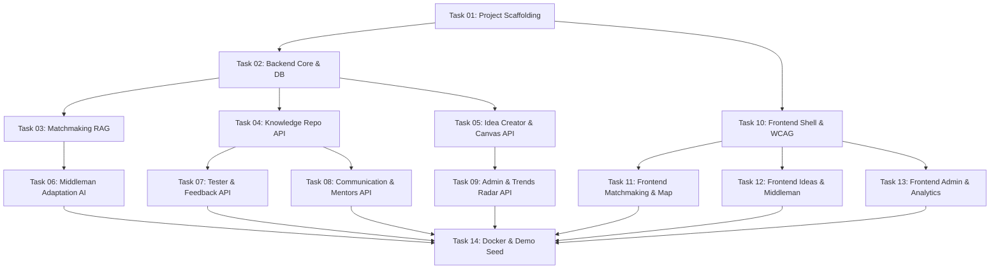

# Przewodnik Przepływu Pracy dla Agentów (Agentic Workflow Master Guide)
## Małopolski Hub Innowacji Społecznych (MHIS)

> **Dla kogo**: Dla autonomicznych subagentów AI (oraz deweloperów), którzy podejmują poszczególne zadania implementacyjne z katalogu `docs/tasks/`.

---

## 1. Filozofia Realizacji Wielozadaniowej

Aby zespół agentów mógł pracować równolegle bez konfliktów, projekt podzielono na **14 atomowych pakietów roboczych (Work Packages)**. Każde zadanie w folderze `docs/tasks/` posiada:
- **Ścisłe granice plikowe** (agenci nie edytują tych samych plików jednocześnie).
- **Zdefiniowane kontrakty wejścia/wyjścia** (Pydantic DTOs & TypeScript Interfaces).
- **Wbudowane testy weryfikacyjne** (Pytest / Vitest / cURL).
- **Zasadę Graceful Degradation** (każda funkcja AI ma deterministyczny fallback offline).

---

## 2. Standardy Jakości Kodu i Rygory Techniczne

### 2.1. Backend (Python / FastAPI)
- **Typowanie**: 100% type hints (`from typing import Optional, List, Dict`).
- **Walidacja**: Pydantic v2 (`from pydantic import BaseModel, Field, ConfigDict`).
- **Obsługa błędów**: Używanie dedykowanych `HTTPException(status_code=..., detail=...)`. Żadnych niespójnych kodów 500.
- **Odporność AI**: Wywołanie modelu LLM zawsze opakowane w blok `try...except`, z automatycznym przełączeniem na generator regułowy lub szablon syntetyczny.

### 2.2. Frontend (React / TypeScript / Tailwind)
- **Zero błędów kompilacji**: Tryb `strict: true` w `tsconfig.json`.
- **Dostępność (WCAG 2.1 AA)**:
  - Każdy interaktywny element musi mieć widoczną ramkę fokusową `focus-visible:ring-2 focus-visible:ring-amber-500`.
  - Wszystkie ikony dekoracyjne muszą posiadać `aria-hidden="true"`.
  - Kontenery dynamiczne z wynikami zapytań muszą posiadać `aria-live="polite"`.
- **Wielojęzyczność i ETR**: Treści przygotowane z myślą o prostym przełączniku na Standard Łatwego Tekstu (ETR).

---

## 3. Procedura Wykonania Zadania przez Agenta

Każdy agent realizujący zadanie `docs/tasks/task_XX_*.md` wykonuje następujące kroki:

1. **Krok 1: Weryfikacja zależności wstępnych**:
   - Sprawdzenie czy zadania nadrzędne (np. Task 01, Task 02) zostały ukończone i czy wymagane modele bazowe istnieją.
2. **Krok 2: Implementacja kodu**:
   - Tworzenie plików ściśle według podanych w zadaniu ścieżek.
   - Zachowanie istniejącej struktury projektu.
3. **Krok 3: Uruchomienie testu weryfikacyjnego**:
   - Wykonanie polecenia podanego w sekcji `Kryteria Akceptacji i Weryfikacja` (np. `pytest tests/test_matchmaking.py`).
4. **Krok 4: Potwierdzenie gotowości**:
   - Odnotowanie zakończenia zadania w głównym rejestrze.
