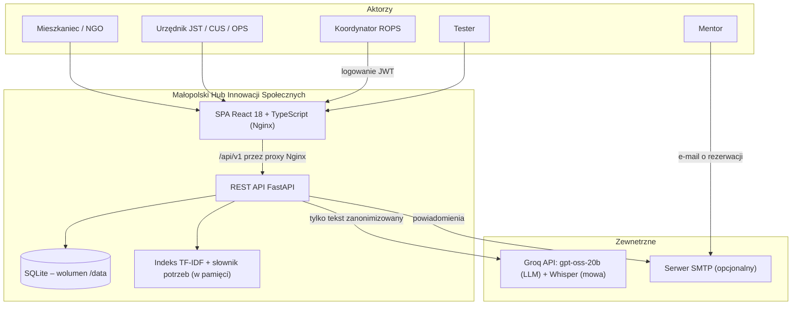
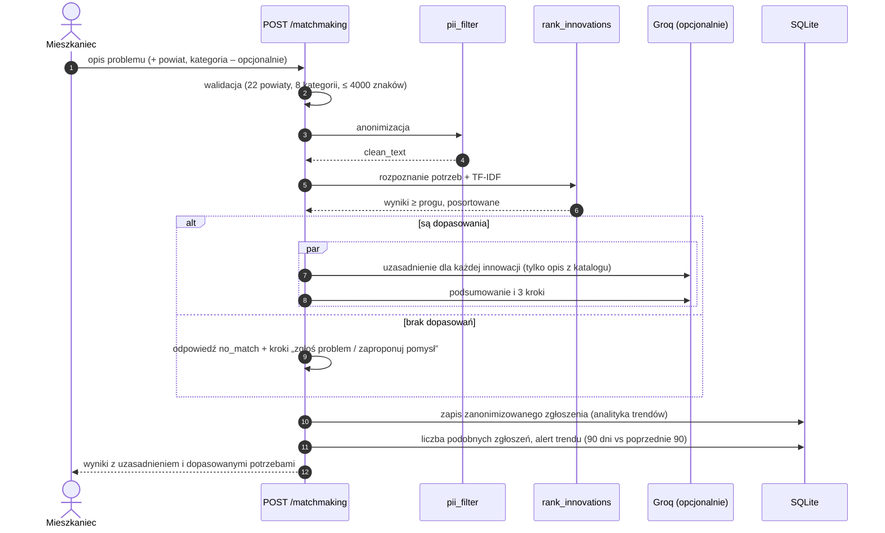
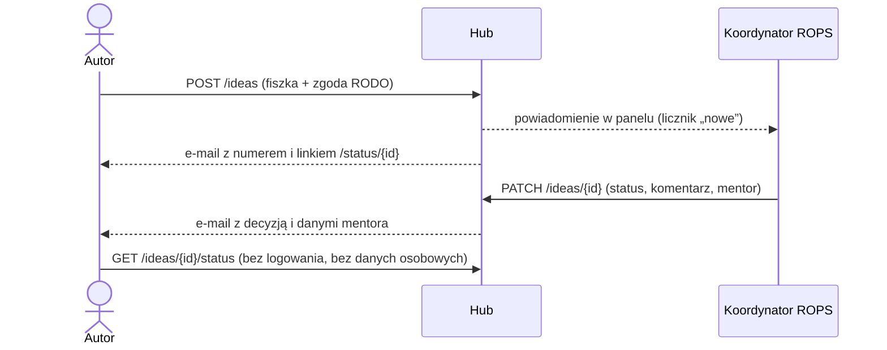

# Architektura Systemu i Integracje AI
## Małopolski Hub Innowacji Społecznych (MHIS)

> **Wersja**: 1.1 (po poprawkach z `docs/QA_REPORT_browser_test.md`)
> Dokument opisuje stan zaimplementowany. Elementy planowane są oznaczone jako **[plan]**.

---

## 1. Kontekst systemu



Bez klucza `GROQ_API_KEY` wszystkie funkcje działają w trybie szablonów (ranking Matchmakingu nie zależy od LLM).

---

## 2. Kontenery (Docker Compose)

| Kontener | Obraz | Port | Rola |
|---|---|---|---|
| `mhis-frontend` | `nginx` + zbudowane SPA | 80, 3000 | pliki statyczne, fallback SPA (`try_files … /index.html`), proxy `/api/` → `backend:8000` |
| `mhis-backend` | `python:3.11-slim` + Uvicorn | 8000 | API, migracje kolumn, seed, self-test; healthcheck `GET /api/v1/health` |
| wolumen `mhis_data` | – | – | `/data/mhis.db` (SQLite) |

---

## 3. Backend

```
backend/app/
├── main.py                  # lifespan: create_all → migrate_sqlite_columns → run_seed → self-test; handlery błędów 422/500
├── core/
│   ├── config.py            # pydantic-settings (.env): Groq, SECRET_KEY, ADMIN_PASSWORD, SMTP_*
│   ├── constants.py         # 22 powiaty (+ miejscownik), 8 kategorii, normalizacja polskich znaków, format liczb
│   ├── security.py          # token JWT koordynatora, zależność require_admin
│   └── database.py          # async SQLAlchemy
├── models/                  # innovation, problem_report, idea_fiszka (+canvas), testing (+tester_signups),
│                            # communication (+mentor_bookings), notification, regional_stat
├── schemas/                 # Pydantic v2 z walidacją słowników, limitów i zgód RODO
├── services/
│   ├── matchmaking_service.py   # rozpoznawanie potrzeb, ranking hybrydowy, próg trafności, alert trendu
│   ├── vector_store.py          # TF-IDF na rdzeniach słów bez polskich znaków
│   ├── pii_filter.py            # PESEL, telefony, e-maile, adresy, kody pocztowe, imiona+nazwiska
│   ├── groq_client.py           # LLM: uzasadnienia dopasowań, synteza, Canwa, czat JST, Whisper
│   ├── notification_service.py  # skrzynka powiadomień + opcjonalny SMTP
│   ├── ai_assistant.py          # checklista Canwy, nabory, szkic wniosku
│   ├── middleman_service.py     # pakiet wdrożeniowy i projekt uchwały (szablon)
│   ├── testing_service.py       # zapisy bez overbookingu, punktacja SUS
│   ├── communication_service.py # wątki, sloty i rezerwacje mentorów
│   ├── knowledge_service.py     # katalog i wyszukiwanie
│   ├── trend_analyzer.py        # radar trendów z danych w bazie
│   └── etr_simplifier.py
├── api/v1/                  # auth, health, matchmaking, voice, knowledge, ideas, testing,
│                            # communication, admin (🔒 cały router), middleman, problems
└── seed/                    # dane JSON + sync_reference_data()
```

---

## 4. Matchmaking (Moduł I – obligatoryjny)



**Ranking** (`matchmaking_service.rank_innovations`):
1. **Rozpoznawanie potrzeb** – słownik 14 pojęć (np. osoby starsze, samotność, bariery w mieszkaniu, dojazd, wykluczenie cyfrowe, opieka) z wyzwalaczami na prefiksach słów bez polskich znaków (np. `dziadk`, `wann`, `lazien`), wyrażeniami z polskimi znakami tam, gdzie forma bez nich byłaby dwuznaczna (`lęk` vs `lekarz`), wykrywaniem wieku 60+ („82-letni”) i podstawowymi słowami angielskimi.
2. **Profil innowacji** – pojęcia z tytułu, hasła, grup docelowych i kategorii mają wagę 1,0, a pojęcia wyłącznie z opisu – 0,5.
3. **Wynik** = 0,6 × pokrycie potrzeb zgłoszenia + 0,3 × podobieństwo TF-IDF (rdzenie 6-znakowe, bez słów funkcyjnych) + 0,08 za zgodną kategorię; maks. 0,97.
4. **Próg trafności 0,35** i wymóg wspólnej potrzeby lub wyraźnego podobieństwa leksykalnego – bełkot i tematy spoza katalogu zwracają `no_match`.
5. **Uzasadnienie** – LLM pisze osobne zdanie dla każdej innowacji (z zakazem dopisywania faktów spoza opisu); bez LLM szablon wymienia faktycznie dopasowane potrzeby i grupy docelowe.

Ten sam ranking służy do automatycznego kojarzenia w Rejestrze Wyzwań JST. Indeks jest przebudowywany po każdej zmianie katalogu w Panelu ROPS.
**[plan]** Embeddingi wielojęzyczne (np. `sentence-transformers`) w PostgreSQL + pgvector jako dodatkowy składnik wyniku.

---

## 5. Ścieżka zgłoszenia pomysłu i odpowiedzi (Moduły III i VI)



Bez skonfigurowanego `SMTP_HOST` e-maile mają status `queued` i są widoczne w skrzynce nadawczej Panelu ROPS.

---

## 6. Middleman dla JST (Moduł VII)

Generator regułowy (bez LLM) – deterministyczny i przewidywalny dla urzędu:
- profil kosztowy i kadrowy dla każdej z 10 innowacji (dla nowych innowacji – profil domyślny),
- skalowanie kosztu wg liczby mieszkańców i odsetka seniorów, koszt miesięczny, roczny i na odbiorcę,
- projekt uchwały z poprawną odmianą („Rady Gminy X”, „Kierownikowi Gminnego Ośrodka Pomocy Społecznej” / „Dyrektorowi Centrum Usług Społecznych”), publikatory Dz. U. do uzupełnienia, zastrzeżenie o weryfikacji prawnej,
- ryzyko przekroczenia budżetu, gdy koszt pierwszego roku > budżet gminy.

Pytania otwarte obsługuje osobny czat (`/middleman/chat`) oparty na LLM.

---

## 7. Frontend

```
frontend/src/
├── App.tsx                 # trasy, tytuły stron per trasa (WCAG 2.4.2), strona 404
├── constants/domain.ts     # powiaty, kategorie, etykiety, formatowanie dat i kwot
├── hooks/useDialog.ts      # dostępne okna dialogowe: fokus, Escape, pułapka Tab, przywrócenie fokusu
├── services/api.ts         # klient Axios, token koordynatora (sessionStorage), czytelne komunikaty błędów
├── store/useAccessibilityStore.ts  # kontrast, rozmiar tekstu, tryb ETR (klasy na <html>/<body>)
├── components/             # pasek dostępności, nawigacja (z menu mobilnym), stopka, pasek Jury, kafelki powiatów
└── views/                  # Home, Matchmaking, Problemy, Baza wiedzy (karta pod /baza-wiedzy/:id),
                            # Kreator pomysłów, Middleman, Tester, Dialog, Panel ROPS,
                            # Status fiszki (/status/:id), Deklaracja dostępności
```

---

## 8. Odporność i bezpieczeństwo

- **Degradacja AI**: brak klucza lub błąd Groq → szablony; endpointy nie zwracają 500 z powodu LLM. Modele rozumujące (gpt-oss) dostają `reasoning_effort=low` przy krótkich zadaniach, aby limit tokenów nie wyczerpał się na rozumowaniu.
- **Błędy**: globalny handler zwraca ogólny komunikat 500 (szczegóły tylko w logach) i czytelne 422.
- **Dane osobowe**: anonimizacja przed zapisem i LLM, zgody RODO w formularzach, endpointy z e-mailami autorów tylko po zalogowaniu, dane demo z domeną `example.org`.
- **Logowanie**: jedno hasło koordynatora (`ADMIN_PASSWORD`) i token JWT ważny 8 h. **[plan]** SSO / Keycloak z rolami (mieszkaniec, NGO, JST, mentor, ROPS).
- **Trwałość**: SQLite w wolumenie; migracja brakujących kolumn przy starcie. **[plan]** PostgreSQL + Alembic.
