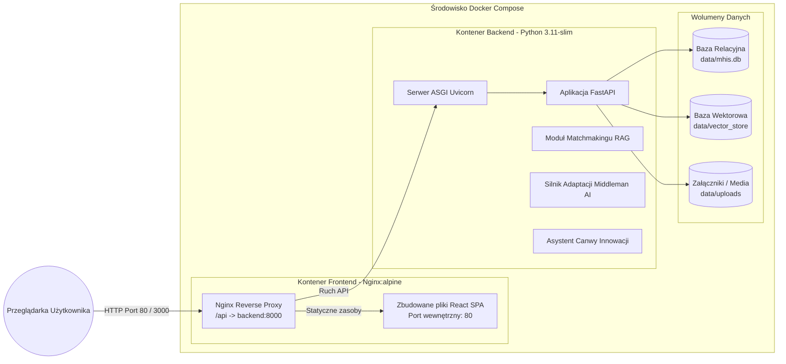
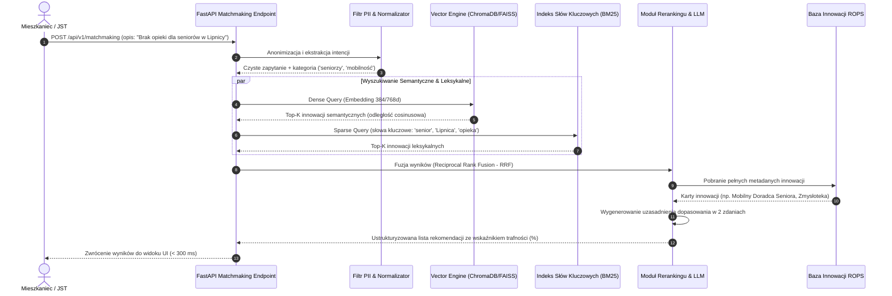
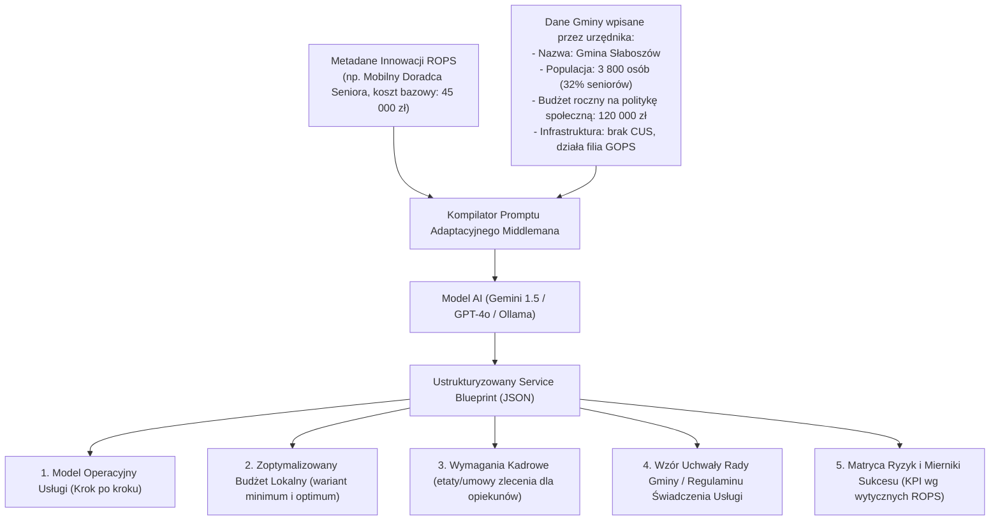

# Architektura Systemu i Integracje AI
## Małopolski Hub Innowacji Społecznych (MHIS)

> **Autor**: Antigravity AI Architecture Team  
> **Wersja**: 1.0.0  
> **Status**: Approved for Multi-Agent Implementation

---

## 1. Diagram Kontekstowy C4 (System Context)

```mermaid
graph TB
    subgraph Uzytkownicy [Aktorzy Systemu]
        Mieszkaniec["Mieszkaniec / Lider NGO"]
        Samorzad["Przedstawiciel JST / CUS"]
        PracownikROPS["Koordynator ROPS Kraków"]
        Mentor["Ekspert / Mentor"]
        Tester["Tester Innowacji"]
    end

    subgraph HubSystem [Małopolski Hub Innowacji Społecznych]
        Frontend["Frontend Web SPA (React + TypeScript + WCAG AA)"]
        BackendAPI["Backend REST API (FastAPI Python)"]
        VectorEngine["Silnik Wektorowy RAG (ChromaDB / FAISS)"]
        RelationalDB["Baza Relacyjna (SQLite / PostgreSQL)"]
        AIEngine["Warstwa AI (LLM / Embeddings)"]
    end

    subgraph Zewnetrzne [Systemy Zewnętrzne i Źródła Danych]
        ROPSData["Baza Innowacji ROPS Kraków / IWS 2.0"]
        GUSData["Dane Demograficzne Powiatów Małopolski (BDL GUS)"]
        ExternalLLM["Dostawca LLM (Google Gemini / OpenAI / Ollama Local)"]
    end

    Mieszkaniec -->|Zgłasza problem, szuka rozwiązań, tworzy fiszkę| Frontend
    Samorzad -->|Szuka innowacji, generuje Service Blueprint w Middlemanie| Frontend
    PracownikROPS -->|Zarządza wiedzą, monitoruje trendy w Małopolsce| Frontend
    Mentor -->|Udziela feedbacku, wspiera innowatorów| Frontend
    Tester -->|Testuje prototypy, wypełnia ankiety SUS| Frontend

    Frontend -->|REST API / SSE (Streaming)| BackendAPI
    BackendAPI -->|Zapytania CRUD| RelationalDB
    BackendAPI -->|Wyszukiwanie podobieństwa wektorowego (Cos/L2)| VectorEngine
    BackendAPI -->|Generowanie treści, mentoring, adaptacja usług| AIEngine
    AIEngine -->|Konektor API| ExternalLLM
    BackendAPI -->|Pobieranie i synchronizacja wiedzy| ROPSData
    BackendAPI -->|Wskaźniki powiatowe| GUSData
```

---

## 2. Architektura Kontenerowa (Container View)



---

## 3. Warstwowa Architektura Backendu (FastAPI)

Backend został zaprojektowany w oparciu o czysty wzorzec domenowy (Clean / Hexagonal Architecture):

```
backend/
├── app/
│   ├── main.py                    # Punkt wejściowy FastAPI, CORS, middleware, lifespan
│   ├── core/
│   │   ├── config.py              # Ustawienia z pydantic-settings (.env)
│   │   ├── security.py            # JWT tokeny, haszowanie, ochrona PII
│   │   └── database.py            # Połączenie SQLAlchemy / sesje asynchroniczne
│   ├── models/                    # Modele ORM (SQLAlchemy)
│   │   ├── innovation.py          # Baza innowacji ROPS
│   │   ├── problem_report.py      # Zgłoszenia problemów mieszkańców
│   │   ├── idea_fiszka.py         # Fiszki i wnioski grantowe
│   │   ├── canvas.py              # 9 bloków Canwy Innowacji Społecznych
│   │   ├── testing.py             # Testy prototypów i ankiety ewaluacyjne
│   │   ├── communication.py       # Pytania Q&A, mentorzy, partnerstwa
│   │   └── regional_stats.py      # Statystyki 22 powiatów Małopolski
│   ├── schemas/                   # Schematy walidacji Pydantic v2 (DTO)
│   │   ├── innovation_schema.py
│   │   ├── matchmaking_schema.py
│   │   ├── idea_schema.py
│   │   ├── middleman_schema.py
│   │   └── admin_trends_schema.py
│   ├── services/                  # Logika biznesowa i integracje AI
│   │   ├── matchmaking_service.py # Hybrydowe wyszukiwanie wektorowe + BM25
│   │   ├── vector_store.py        # Adapter ChromaDB / FAISS z lokalnym fallbackiem
│   │   ├── ai_assistant.py        # Mentoring pomysłów, generowanie pytań, luki logiczne
│   │   ├── middleman_service.py   # Generator pakietów wdrożeniowych dla JST
│   │   ├── etr_simplifier.py      # Silnik upraszczania tekstu do formatu ETR
│   │   └── trend_analyzer.py      # Klasteryzacja i wykrywanie anomalii potrzeb
│   ├── api/v1/                    # Kontrolery endpointów REST
│   │   ├── matchmaking.py         # [Moduł I]
│   │   ├── knowledge.py           # [Moduł II]
│   │   ├── ideas.py               # [Moduł III]
│   │   ├── testing.py             # [Moduł IV]
│   │   ├── communication.py       # [Moduł V]
│   │   ├── admin.py               # [Moduł VI]
│   │   └── middleman.py           # [Moduł VII]
│   └── seed/                      # Generator realistycznych danych demonstracyjnych ROPS
│       ├── seed_runner.py
│       └── data/
│           ├── innovations_rops.json
│           ├── malopolska_powiaty.json
│           └── sample_problems.json
```

---

## 4. Rurociąg Matchmakingu Społecznego RAG (Moduł I - Obligatoryjny)



---

## 5. Silnik Middlemana Innowacji (Moduł VII - Killer Feature)

Silnik Middlemana odpowiada na kluczowe pytanie stawiane przez samorządy: **"Jak zaadaptować sprawdzoną innowację ROPS do realiów mojej gminy?"**.



---

## 6. Architektura Frontendu (React + TypeScript)

```
frontend/
├── src/
│   ├── main.tsx                   # Inicjalizacja React 18 Root
│   ├── App.tsx                    # Routing (React Router v6) & Providers
│   ├── assets/                    # Logo ROPS Kraków, ikony, grafiki
│   ├── components/                # Reużywalne komponenty
│   │   ├── common/                # Button, Input, Modal, Badge, Card, Spinner
│   │   ├── accessibility/         # AccessibilityBar (kontrast, font zoom, ETR mode)
│   │   ├── layout/                # Navbar, Footer, Breadcrumbs, SkipToContent
│   │   ├── canvas/                # Interaktywny grid 9 pól Canwy Innowacji
│   │   ├── map/                   # SVG Interaktywna Mapa Powiatów Małopolski
│   │   └── visualizer/            # Podgląd konceptu innowacji z asystentem
│   ├── views/                     # Widoki modułów
│   │   ├── HomeView.tsx           # Dashboard główny Hubu
│   │   ├── MatchmakingView.tsx    # [Moduł I] Inteligentny kojarzyciel potrzeb
│   │   ├── KnowledgeView.tsx      # [Moduł II] Biblioteka Innowacji & Kondycja Regionu
│   │   ├── IdeaCreatorView.tsx    # [Moduł III] Fiszka, Wniosek grantowy, Canwa
│   │   ├── TesterView.tsx         # [Moduł IV] Tablica testów i ewaluacja SUS
│   │   ├── CommunicationView.tsx  # [Moduł V] Dialog ROPS, mentorzy, partnerstwa
│   │   ├── AdminDashboardView.tsx # [Moduł VI] Panel koordynatora i Radar Trendów
│   │   └── MiddlemanView.tsx      # [Moduł VII] Adaptacja innowacji do usług dla JST
│   ├── hooks/                     # Custom hooki (useAccessibility, useMatchmaker, useAuth)
│   ├── services/                  # Klient HTTP (Axios / Fetch) ze schematami Zod
│   ├── store/                     # Globalny stan (Zustand: dostępność, koszyk innowacji, profil)
│   └── styles/                    # Tailwind CSS, motywy wysokiego kontrastu (WCAG)
```

---

## 7. Strategia Odporności na Awarię i Tryb Offline

1. **AI Graceful Degradation**:
   - Jeśli brak klucza API do Gemini/OpenAI lub brak połączenia z siecią, system **automatycznie przełącza się na lokalny silnik heurystyczno-wektorowy**:
     - Wyszukiwanie semantyczne wykorzystuje lokalne embeddingi `all-MiniLM-L6-v2` lub bazę podobieństwa TF-IDF/BM25.
     - Asystent Middlemana wykorzystuje wbudowany szablon regułowy z dynamiczną parametryzacją budżetu i wzorem uchwały.
   - Aplikacja **nigdy nie rzuca błędu 500** przy niedostępności zewnętrznego serwera LLM.
2. **Persistence i Wolumeny**:
   - Baza SQLite oraz indeksy wektorowe są montowane jako wolumeny Docker (`/data/mhis.db`), zapewniając trwałość danych między restartami kontenerów.
