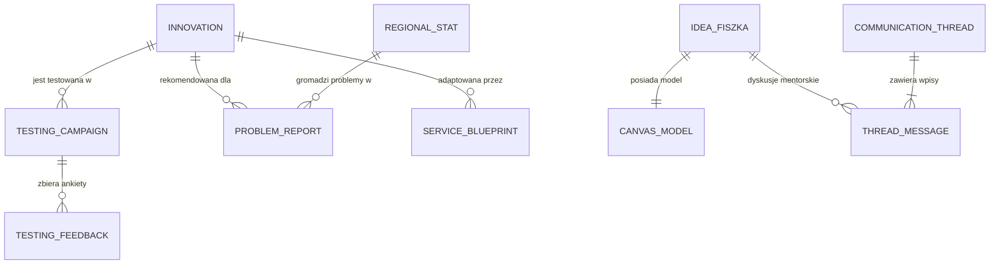

# Modele Danych i Schematy Bazodanowe
## Małopolski Hub Innowacji Społecznych (MHIS)

> **Zarządzanie Stanem**: SQLAlchemy ORM (Backend) + Pydantic v2 Schemas + TypeScript Interfaces (Frontend)

---

## 1. Diagram Relacji Encji (ERD)



---

## 2. Kluczowe Encje Bazy Danych

### 2.1. `Innovation` (Katalog Sprawdzonych Innowacji ROPS)
```python
class Innovation(Base):
    __tablename__ = "innovations"

    id: str = Column(String, primary_key=True)                 # np. 'rops-inn-001'
    title: str = Column(String, nullable=False)               # np. 'Mobilny Doradca Seniora'
    tagline: str = Column(String, nullable=False)             # Krótkie hasło wdrożeniowe
    category: str = Column(String, index=True)                # 'seniorzy', 'zdrowie_psychiczne', 'ozn', 'integracja'
    target_groups: list[str] = Column(JSON, default=list)     # ['seniorzy', 'opiekunowie', 'osoby_samotne']
    full_description: str = Column(Text, nullable=False)      # Dokładny opis metodyki
    readiness_level: str = Column(String)                     # 'Gotowa do skalowania', 'W fazie testów'
    budget_bracket: str = Column(String)                      # 'Niski (<20k)', 'Średni (20-60k)', 'Wysoki (>60k)'
    video_url: str = Column(String, nullable=True)            # Link do wideo prezentującego innowację
    handbook_url: str = Column(String, nullable=True)         # Link do podręcznika dobrych praktyk
    etr_summary: str = Column(Text, nullable=True)            # Wersja w prostym języku (ETR)
    origin_poviat: str = Column(String, nullable=True)        # Powiat macierzysty innowacji
    is_published: bool = Column(Boolean, default=True)
    created_at: datetime = Column(DateTime, default=datetime.utcnow)
```

### 2.2. `ProblemReport` (Zgłoszenie Potrzeby Mieszkańca / JST)
```python
class ProblemReport(Base):
    __tablename__ = "problem_reports"

    id: str = Column(String, primary_key=True)
    raw_text: str = Column(Text, nullable=False)              # Zgłoszenie po filtracji PII
    category: str = Column(String, index=True)
    powiat: str = Column(String, index=True)                  # np. 'tarnowski', 'gorlicki'
    gmina: str = Column(String, nullable=True)
    reporter_type: str = Column(String)                       # 'mieszkaniec', 'ngo', 'jst'
    matched_innovations: list[str] = Column(JSON)             # IDs powiązanych innowacji
    status: str = Column(String, default="matched")           # 'matched', 'needs_idea', 'converted'
    created_at: datetime = Column(DateTime, default=datetime.utcnow)
```

### 2.3. `IdeaFiszka` & `CanvasModel` (Kreator Pomysłów)
```python
class IdeaFiszka(Base):
    __tablename__ = "idea_fiszkas"

    id: str = Column(String, primary_key=True)
    title: str = Column(String, nullable=False)
    summary: str = Column(Text, nullable=False)
    target_audience: str = Column(String, nullable=False)
    implementation_stage: str = Column(String)                # 'pomysl', 'prototyp', 'pilot'
    author_name: str = Column(String, nullable=False)
    author_email: str = Column(String, nullable=False)
    author_type: str = Column(String)                         # 'indywidualny', 'ngo', 'grupa_nieformalna'
    powiat: str = Column(String, nullable=False)
    status: str = Column(String, default="submitted")         # 'draft', 'submitted', 'verified_by_rops'
    admin_notes: str = Column(Text, nullable=True)
    assigned_mentor_id: str = Column(String, nullable=True)
    created_at: datetime = Column(DateTime, default=datetime.utcnow)

class CanvasModel(Base):
    __tablename__ = "canvas_models"

    id: str = Column(String, primary_key=True)
    fiszka_id: str = Column(String, ForeignKey("idea_fiszkas.id"))
    problem: str = Column(Text)
    target_group: str = Column(Text)
    value_proposition: str = Column(Text)
    barriers: str = Column(Text)
    resources: str = Column(Text)
    partners: str = Column(Text)
    testing_plan: str = Column(Text)
    metrics: str = Column(Text)
    scalability: str = Column(Text)
    ai_audit_score: int = Column(Integer, default=0)
    ai_audit_feedback: dict = Column(JSON, default=dict)
```

### 2.4. `TestingCampaign` & `TestingFeedback` (Tester Innowacji)
```python
class TestingCampaign(Base):
    __tablename__ = "testing_campaigns"

    id: str = Column(String, primary_key=True)
    innovation_id: str = Column(String, ForeignKey("innovations.id"))
    campaign_name: str = Column(String, nullable=False)
    goal_description: str = Column(Text, nullable=False)
    tester_profile_needed: str = Column(String)               # np. 'Seniorzy 70+ ze smartfonem'
    slots_total: int = Column(Integer, default=20)
    slots_taken: int = Column(Integer, default=0)
    status: str = Column(String, default="open")              # 'open', 'ongoing', 'closed'
    deadline: date = Column(Date)

class TestingFeedback(Base):
    __tablename__ = "testing_feedback"

    id: str = Column(String, primary_key=True)
    campaign_id: str = Column(String, ForeignKey("testing_campaigns.id"))
    tester_role: str = Column(String)                         # 'senior', 'opiekun', 'ekspert'
    sus_score: int = Column(Integer)                          # 0 - 100 System Usability Scale
    usability_rating: int = Column(Integer)                   # 1 - 5 gwiazdek
    identified_barriers: str = Column(Text)
    improvement_proposals: str = Column(Text)
    created_at: datetime = Column(DateTime, default=datetime.utcnow)
```

### 2.5. `RegionalStat` (Wskaźniki 22 Powiatów Małopolski)
```python
class RegionalStat(Base):
    __tablename__ = "regional_stats"

    powiat_code: str = Column(String, primary_key=True)       # np. 'PL-1206' (gorlicki)
    powiat_name: str = Column(String, nullable=False)
    population: int = Column(Integer)
    senior_share_pct: float = Column(Float)                   # % osób w wieku poprodukcyjnym
    youth_share_pct: float = Column(Float)
    demographic_trend: str = Column(String)                   # 'depopulacja', 'stabilny', 'wzrost'
    reported_problems_count: int = Column(Integer, default=0)
    active_innovations_count: int = Column(Integer, default=0)
    key_social_challenge: str = Column(String)
```
