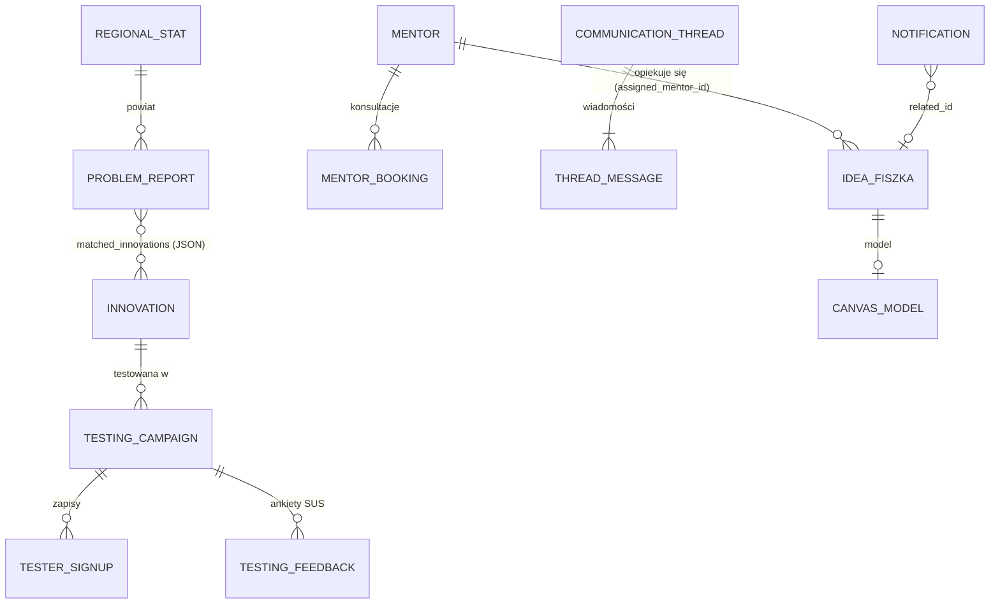

# Modele Danych i Schematy Bazodanowe
## Małopolski Hub Innowacji Społecznych (MHIS)

> **Warstwy**: SQLAlchemy 2.0 (async, SQLite) → schematy Pydantic v2 (`backend/app/schemas/`) → interfejsy TypeScript (`frontend/src/types/index.ts`).
> **Słowniki domenowe** (22 powiaty, 8 kategorii, formy w miejscowniku): `backend/app/core/constants.py` i `frontend/src/constants/domain.ts`.

---

## 1. Diagram relacji

---

## 2. Encje

### `innovations` – katalog innowacji
| Pole | Typ | Uwagi |
|---|---|---|
| `id` | str PK | `rops-inn-NNN` (nowe ID nadaje API) |
| `title`, `tagline`, `full_description` | str / text | |
| `category` | str | jedna z 8 kategorii: `seniorzy`, `uslugi_opiekuncze`, `dostepnosc`, `zdrowie_psychiczne`, `wykluczenie_cyfrowe`, `edukacja`, `integracja`, `usamodzielnienie` |
| `target_groups` | JSON list | |
| `readiness_level`, `budget_bracket` | str | |
| `video_url`, `handbook_url` | str? | tylko `https://`; puste, dopóki ROPS nie poda zweryfikowanych materiałów |
| `etr_summary` | text? | wersja w tekście łatwym do czytania |
| `origin_poviat` | str? | |
| `is_published` | bool | `DELETE` w API ustawia `false` |

### `problem_reports` – zgłoszenia (Matchmaking i Rejestr Wyzwań JST)
| Pole | Typ | Uwagi |
|---|---|---|
| `id` | str PK | `prob-xxxxxxxx` |
| `title` | str? | z Matchmakingu: pierwsze 80 znaków opisu |
| `raw_text`, `clean_text` | text | zapisywany jest wyłącznie tekst **po anonimizacji** |
| `category`, `powiat`, `gmina` | str? | |
| `reporter_type` | str | `urzednik_jst`, `pracownik_ops_cus`, `mieszkaniec`, `ngo` |
| `reporter_name`, `reporter_role` | str? | tylko dla zgłoszeń urzędników |
| `urgency` | str | `krytyczny`, `wysoki`, `standardowy` |
| `affected_count` | int | |
| `matched_innovations` | JSON list | wynik rankingu w momencie zgłoszenia |
| `assigned_innovation_id`, `assigned_notes` | str? | |
| `status` | str | `matched` (anonimowe zapytanie Matchmakingu – ukryte w rejestrze), `nowy`, `w_analizie`, `przypisana_innowacja`, `wdrazany`, `rozwiazany` |

### `idea_fiszkas` – fiszki pomysłów
| Pole | Typ | Uwagi |
|---|---|---|
| `id` | str PK | `fiszka-xxxxxxxx` – numer podawany autorowi |
| `title`, `summary`, `target_audience`, `powiat` | | |
| `implementation_stage` | str | `pomysl`, `prototyp`, `pilotaz`, `wdrozenie` |
| `author_name`, `author_email`, `author_type` | | widoczne tylko w panelu ROPS (🔒) |
| `status` | str | `submitted`, `in_review`, `needs_changes`, `approved`, `rejected` |
| `admin_notes` | text? | komentarz koordynatora – trafia do autora |
| `assigned_mentor_id` | str? | |
| `rodo_consent_at` | datetime | moment udzielenia zgody |
| `created_at`, `updated_at` | datetime | |

### `canvas_models` – 9 pól Canwy (tabela przygotowana pod zapis Canwy przy fiszce)

### `testing_campaigns`, `tester_signups`, `testing_feedback` – Tester Innowacji
- `testing_campaigns.status`: `open` → `full` (automatycznie po zapełnieniu) → `closed`. `slots_taken` nigdy nie przekracza `slots_total`.
- `tester_signups`: `campaign_id`, `tester_name`, `tester_email` (unikalny w ramach kampanii, porównywany bez wielkości liter), `tester_role`, `motivation`, `guardian_consent` (wymagane dla roli `mlodziez`).
- `testing_feedback`: `sus_answers` (JSON, 10 × 1–5), `sus_score` (float 0–100, liczony na serwerze), `usability_rating` (1–5), bariery i propozycje.

### `communication_threads`, `thread_messages`, `mentors`, `mentor_bookings` – komunikacja
- Kategorie wątków: `rops_qa`, `poszukiwanie_partnera`, `konsultacja_mentorska`; role: `mieszkaniec`, `ngo`, `jst`, `mentor`, `rops_ekspert`.
- `mentors.available_hours` (np. „Środy 16:00 - 19:00”) jest parsowane na sloty 60-minutowe.
- `mentor_bookings`: `mentor_id`, `slot_start` (czas lokalny), `requester_name`, `requester_email`, `topic`.

### `notifications` – powiadomienia i skrzynka nadawcza
| Pole | Typ | Uwagi |
|---|---|---|
| `recipient` | str | adres e-mail lub `rops_admin` |
| `channel` | str | `panel` (koordynator ROPS) lub `email` |
| `subject`, `body` | | |
| `related_type`, `related_id` | str? | `fiszka`, `booking`, `campaign`, `problem` |
| `delivery_status` | str | `in_app`, `queued` (brak SMTP), `sent`, `failed` |
| `is_read` | bool | dotyczy powiadomień panelu |

Zdarzenia tworzące powiadomienia: nowa fiszka, decyzja w sprawie fiszki, zapis na testy, komplet testerów, rezerwacja konsultacji, krytyczne wyzwanie w rejestrze.

### `regional_stats` – 22 powiaty
`powiat_code`, `powiat_name`, `population`, `senior_share_pct`, `youth_share_pct`, `demographic_trend`, `reported_problems_count` (dane bazowe z diagnozy), `active_innovations_count`, `key_social_challenge`.

---

## 3. Migracje i dane startowe

- `create_all()` tworzy brakujące tabele, a funkcja `migrate_sqlite_columns` w `app/main.py` dodaje brakujące kolumny do istniejących tabel na podstawie modeli (rozwiązanie przejściowe – docelowo PostgreSQL + Alembic).
- `GET /health` zwraca `schema_ok` i listę brakujących kolumn, a przy starcie wykonywany jest self-test Matchmakingu.
- `seed_runner.run_seed()` wypełnia puste tabele z `app/seed/data/*.json`; `sync_reference_data()` przy każdym starcie koryguje istniejące bazy (usuwa placeholderowe linki wideo/PDF, zmienia domenę e-maili mentorów na `example.org`, zamyka przepełnione kampanie, usuwa wpisy testowe z prefiksem `TEST-QA` / `QA-TEST`).
