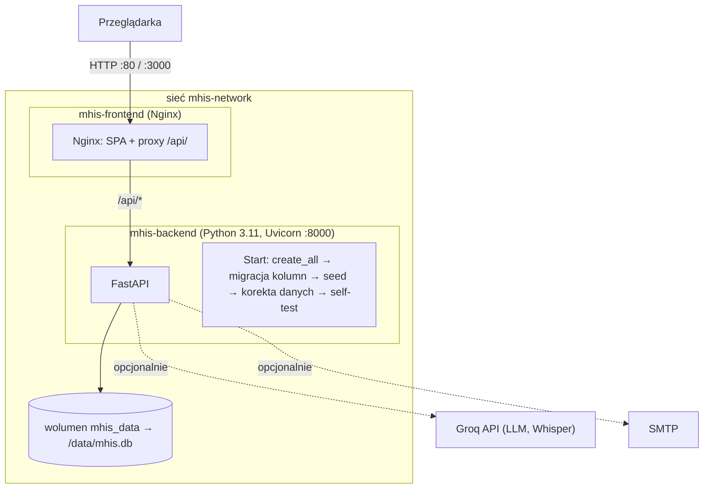

# Infrastruktura, Konteneryzacja i Analiza TCO
## Małopolski Hub Innowacji Społecznych (MHIS)

> **Start jedną komendą**: `docker compose up --build`
> Pełna konfiguracja: `docker-compose.yml` i `.env.example` w katalogu głównym.

---

## 1. Topologia



- Frontend startuje dopiero, gdy backend przejdzie healthcheck (`GET /api/v1/health`).
- Indeks wyszukiwania jest budowany w pamięci przy starcie i po każdej zmianie katalogu – nie wymaga osobnego wolumenu.

---

## 2. Zmienne środowiskowe (backend)

| Zmienna | Domyślnie | Opis |
|---|---|---|
| `DATABASE_URL` | `sqlite+aiosqlite:////data/mhis.db` | baza danych |
| `GROQ_API_KEY`, `GROQ_MODEL` | puste, `openai/gpt-oss-20b` | LLM i Whisper; bez klucza – tryb szablonów |
| `SECRET_KEY` | wartość demo | klucz podpisu tokenów JWT – **zmień w produkcji** |
| `ADMIN_PASSWORD` | `rops-demo-2026` | hasło Panelu ROPS – **zmień przed publicznym udostępnieniem** |
| `SMTP_HOST`, `SMTP_PORT`, `SMTP_USER`, `SMTP_PASSWORD` | puste, 587 | wysyłka e-maili; bez `SMTP_HOST` wiadomości trafiają do skrzynki nadawczej w panelu |
| `CORS_ORIGINS` | localhost | dozwolone pochodzenia |

Typowe operacje:
```bash
docker compose up -d --build          # budowa i start
docker compose logs -f backend        # logi (migracje, self-test Matchmakingu)
docker compose down -v                # usunięcie kontenerów i bazy demo (wolumen mhis_data)
cd backend && python -m pytest -q     # testy backendu (osobna baza: ustaw DATABASE_URL)
```

---

## 3. Szacunkowy koszt utrzymania (TCO)

Założenia: 5 000 zapytań Matchmakingu miesięcznie (~2 000 tokenów każde z uzasadnieniami), ~500 nagrań głosowych po 30 s. Ceny API wg cenników dostawców – do weryfikacji przy wdrożeniu.

| Składnik | Założenie | Koszt / m-c |
|---|---|---|
| Serwer VPS (Docker) | 4 vCPU, 8 GB RAM, chmura krajowa | ok. 120 zł |
| Kopie zapasowe, domena, certyfikat | backup dzienny, 30 dni | ok. 30 zł |
| LLM (Groq, gpt-oss-20b) | ~10 mln tokenów | ok. 10–20 zł |
| Transkrypcja mowy (Whisper) | ~4 h nagrań | < 5 zł |
| Licencje | FastAPI, React, SQLite/PostgreSQL – open source | 0 zł |
| **Infrastruktura i API razem** | | **ok. 170–200 zł** |
| Utrzymanie techniczne | ok. 0,1 etatu programisty (aktualizacje, bezpieczeństwo) | ok. 1 500 zł |

Warianty:
- **On-premise ROPS / Urząd Marszałkowski** – koszt serwera pokryty istniejącą infrastrukturą; LLM można wyłączyć (tryb szablonów) lub zastąpić modelem lokalnym **[plan]**.
- **Wysoka skala** – PostgreSQL + pgvector, 2 instancje backendu, CDN dla filmów Biblioteki Innowacji **[plan]**; szacunkowo kilkaset zł miesięcznie plus API proporcjonalnie do ruchu.

---

## 4. Bezpieczeństwo i RODO

1. **Brak prawdziwych danych osobowych w demo** – osoby i organizacje są fikcyjne, e-maile w domenie `example.org`.
2. **Anonimizacja** – `services/pii_filter.py` maskuje PESEL, telefony, e-maile, adresy, kody pocztowe oraz typowe imiona z nazwiskami przed zapisem zgłoszenia i przed wysłaniem tekstu do LLM. Filtr jest heurystyczny – nie zastępuje oceny inspektora ochrony danych.
3. **Zgody** – fiszka, zapis na testy i rezerwacja konsultacji wymagają zgody RODO; moment zgody fiszki jest zapisywany (`rodo_consent_at`).
4. **Dostęp** – dane kontaktowe autorów, radar trendów, powiadomienia i edycja katalogu wymagają tokenu koordynatora (`POST /auth/login`). Wersja produkcyjna: SSO z rolami **[plan]**.
5. **Błędy** – odpowiedzi 500 nie zawierają SQL ani parametrów; szczegóły tylko w logach serwera.
6. **Do zrobienia przed produkcją** – HTTPS, nagłówki bezpieczeństwa w Nginx (CSP, `X-Frame-Options`, `X-Content-Type-Options`), uruchamianie kontenerów jako użytkownik bez uprawnień root, limit zapytań (rate limiting) dla endpointów publicznych, zmiana `SECRET_KEY` i `ADMIN_PASSWORD`.
