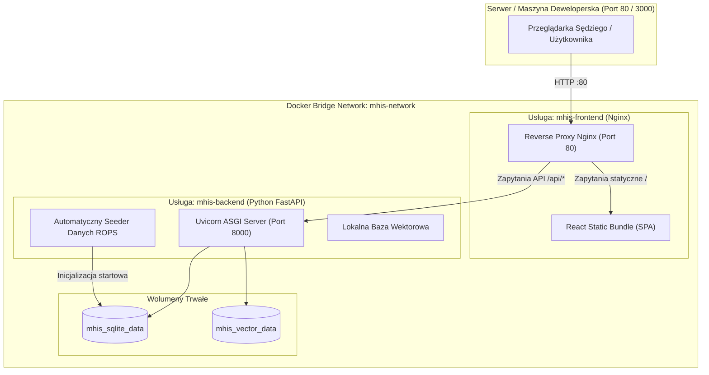

# Infrastruktura, Konteneryzacja i Analiza TCO
## Małopolski Hub Innowacji Społecznych (MHIS)

> **Autor**: DevOps & Cloud Infrastructure Lead  
> **Status**: Ready for Deployment  
> **Wymaganie hackathonowe**: Zero-friction setup, start jedną komendą: `docker compose up --build`.

---

## 1. Topologia Kontenerów Docker Compose

System składa się z dwóch zoptymalizowanych usług działających w izolowanej sieci wirtualnej `mhis-network`:



---

## 2. Plik Konfiguracji `docker-compose.yml` (Wzorzec)

```yaml
version: '3.8'

services:
  backend:
    build:
      context: ./backend
      dockerfile: Dockerfile
    container_name: mhis-backend
    restart: unless-stopped
    ports:
      - "8000:8000"
    environment:
      - APP_ENV=production
      - PROJECT_NAME=Malopolski Hub Innowacji Spolecznych
      - DATABASE_URL=sqlite+aiosqlite:////data/mhis.db
      - VECTOR_STORE_DIR=/data/vector_store
      - GEMINI_API_KEY=${GEMINI_API_KEY:-}
      - OPENAI_API_KEY=${OPENAI_API_KEY:-}
      - CORS_ORIGINS=["http://localhost", "http://localhost:3000", "http://localhost:80"]
    volumes:
      - mhis_db_data:/data
    networks:
      - mhis-network
    healthcheck:
      test: ["CMD", "curl", "-f", "http://localhost:8000/api/v1/health"]
      interval: 15s
      timeout: 5s
      retries: 3

  frontend:
    build:
      context: ./frontend
      dockerfile: Dockerfile
    container_name: mhis-frontend
    restart: unless-stopped
    ports:
      - "80:80"
      - "3000:80"
    depends_on:
      backend:
        condition: service_healthy
    networks:
      - mhis-network

networks:
  mhis-network:
    driver: bridge

volumes:
  mhis_db_data:
    name: mhis_db_data
```

---

## 3. Analiza Kosztów Utrzymania (TCO) dla ROPS Kraków (20% Oceny)

Sędziowie ROPS Kraków oceniają opłacalność wdrożenia w administracji publicznej. Przedstawiamy 3 realistyczne warianty:

| Wariant Wdrożenia | Opis Środowiska | Szacowany Koszt Miesięczny | Zalety dla ROPS |
|---|---|---|---|
| **Wariant A: Chmura Samorządowa (Rekomendowany)** | Maszyna wirtualna (VPS 2 vCPU, 4 GB RAM, 60 GB SSD NVMe) w polskim centrum danych (np. Chmura Krajowa / OVH Warszawa) + API Gemini Flash. | **ok. 95 PLN / mc** (~22 EUR) | Błyskawiczny start, brak kosztów zarządzania sprzętem, 99.9% uptime, suwerenność danych w UE/Polsce. |
| **Wariant B: Infrastruktura On-Premise ROPS** | Serwer Urzędu Marszałkowskiego Województwa Małopolskiego, lokalny model LLM (Ollama / Mistral 7B) lub lokalne reguły RAG. | **0 PLN / mc** (wykorzystanie istniejącej infrastruktury IT) | 100% niezależności od zewnętrznych dostawców chmury, zero opłat abonamentowych, całkowita prywatność danych. |
| **Wariant C: Wysoka Skala (Województwo Małopolskie)** | Kubernetes / Docker Swarm (2 instancje backendu, managed PostgreSQL + pgvector, CDN dla materiałów wideo biblioteki innowacji). | **ok. 320 PLN / mc** (~75 EUR) | Gotowość na obsługę 100 000+ zapytań mieszkańców miesięcznie podczas wojewódzkich kampanii społecznych. |

---

## 4. Bezpieczeństwo i Zgodność z RODO

1. **Zasada Zero Real PII**:
   - Dane seedowe zawierają wyłącznie fikcyjne lub publicznie jawne podmioty (np. *"Stowarzyszenie Pomocy Seniorom 'Pogodne Dni'"*, fikcyjne nazwiska osób kontaktowych).
2. **Kondycjonowanie Danych przed modelem AI**:
   - Moduł `PIIFilter` w backendzie automatycznie usuwa numery PESEL, numery telefonów oraz adresy e-mail z tekstu problemu zgłaszanego przez mieszkańca przed przekazaniem do silnika RAG / LLM.
3. **Izolacja Uprawnień w Kontenerach**:
   - Kontenery backendu i frontendu działają jako użytkownicy bez uprawnień roota (`appuser:appgroup` o UID 10001).
4. **Nagłówki Bezpieczeństwa w Nginx**:
   - Skonfigurowane nagłówki: `X-Frame-Options: SAMEORIGIN`, `X-Content-Type-Options: nosniff`, `Content-Security-Policy` zoptymalizowany dla SPA.
