# Małopolski Hub Innowacji Społecznych (MHIS) – Pitch Deck (10 Slajdów)
## Oficjalny Plan Prezentacji Finałowej & Scenariusz Obrony przed Jury (HackYeah 2026)

---

### ⏱️ Oś Czasu Prezentacji (Format 3-minutowy: 180 sekund)

```mermaid
gantt
    title Scenariusz 3-Minutowego Pitchu (180s)
    dateFormat X
    axisFormat %s s
    section 1. Problem & Hook
    Slajd 1 (Tytuł i Misja) : 0, 15
    Slajd 2 (Wyzwania 22 Powiatów) : 15, 35
    section 2. Rozwiązanie & Demo
    Slajd 3 (Ekosystem MHIS) : 35, 55
    Slajd 4 (Matchmaking & Live Demo) : 55, 85
    Slajd 5 (Middleman JST - Killer Feature) : 85, 115
    Slajd 6 (WCAG 2.1 AA & Tryb ETR) : 115, 130
    Slajd 7 (Canwa, Tester SUS & Radar) : 130, 145
    section 3. TCO, Wdrożenie & Finał
    Slajd 8 (Architektura & Zero-PII) : 145, 160
    Slajd 9 (Ekonomia TCO & 48h Wdrożenie) : 160, 172
    Slajd 10 (Zespół, 40/40 Pkt & CTA) : 172, 180
```

---

## 🎯 Szczegółowy Rozkład 10 Slajdów

### Slajd 1: Tytuł i Hak Uwagi (The Hook & Mission)
- **Tytuł**: Małopolski Hub Innowacji Społecznych (MHIS)
- **Podtytuł**: Cyfrowy akcelerator innowacji społecznych dla mieszkańców, samorządów i ROPS Kraków
- **Główny Hak Wizualny / Hasło**:
  > *"Prawie 200 przetestowanych innowacji społecznych w Małopolsce czeka na wdrożenie. Czas przenieść je z półek urzędów wprost do 182 małopolskich gmin."*
- **Kluczowe plakietki (Badges)**:
  - `HackYeah 2026` | `Partner: ROPS Kraków` | `100% Modułów Zrealizowanych (40/40 pkt)` | `WCAG 2.1 AA` | `Docker Ready`
- **Kwestia prezentera (0:00 - 0:15)**:
  > *"Szanowni Jurorzy, Małopolska to lider innowacji społecznych w Polsce – ROPS przetestował ich blisko 200. Jednak największy dramat polega na tym, że sołtys w Gorlicach czy wójt w Dąbrowie Tarnowskiej często nawet nie wie, że rozwiązanie ich problemu już istnieje i leży w Krakowie na półce. Przedstawiamy Małopolski Hub Innowacji Społecznych – cyfrowy pomost, który łączy mieszkańców z gotowymi rozwiązaniami."*

---

### Slajd 2: Problem i Asymetria Regionu (The Regional Pain Point)
- **Tytuł**: Zróżnicowana Małopolska: 22 Powiaty, Różne Wyzwania
- **Trzy Główne Bóle Regionu**:
  1. **Gwałtowne starzenie się i wyludnianie**: Powiaty gorlicki, dąbrowski i miechowski notują indeks starości przekraczający 130 seniorów na 100 dzieci.
  2. **Bariera wdrożeniowa w 182 gminach (JST)**: Samorządowcy chcą pomagać, ale brakuje im kadr, procedur i gotowych projektów uchwał, by przekształcić innowację w oficjalną usługę CUS/OPS.
  3. **Bariery cyfrowe i językowe**: Seniorzy i osoby z niepełnosprawnościami odbijają się od urzędniczego żargonu i skomplikowanych formularzy.
- **Wizualizacja**:
  - Infografika kontrastu demograficznego: boom w wianuszku krakowskim vs depopulacja i starzenie na peryferiach.
- **Kwestia prezentera (0:15 - 0:35)**:
  > *"Małopolska jest krańcowo zróżnicowana. Gdy wianek krakowski pęka w szwach od nowych mieszkańców, powiaty gorlicki i dąbrowski dramatycznie się starzeją. Gminy mają budżety, ale nie wiedzą, JAK wdrożyć innowację od strony formalno-prawnej. Z kolei mieszkańcy, zwłaszcza seniorzy, nie potrafią przebić się przez urzędowy język. Istniejące narzędzia to statyczne PDF-y i bazy bez inteligencji."*

---

### Slajd 3: Rozwiązanie – MHIS jako Zintegrowany Ekosystem
- **Tytuł**: MHIS – Trzy Filary Działania dla Wszystkich Aktorów
- **Struktura Rozwiązania (Trio Ekosystemu)**:
  1. **Dla Mieszkańca**: Rozmowa w języku naturalnym (tekst/głos), natychmiastowe dopasowanie pomocy i uproszczony język ETR (Easy-to-Read).
  2. **Dla Samorządu (JST/CUS)**: **Middleman Innowacji** – 1 kliknięcie generuje pakiet wdrożeniowy (Service Blueprint, kalkulacja kosztów, projekt uchwały).
  3. **Dla ROPS Kraków**: Pulpit analityczny, kolejka moderacji fiszek i Radar Trendów Społecznych w 22 powiatach.
- **Wyróżnik regulaminowy**:
  - Wszystkie 7 modułów wyzwania zrealizowane i działające w 100% (40/40 pkt).
- **Kwestia prezentera (0:35 - 0:55)**:
  > *"Nasz Hub to nie kolejna wyszukiwarka. To aktywny, inteligentny ekosystem. Mieszkaniec mówi zwykłym językiem, system znajduje rozwiązanie. Samorządowiec otrzymuje gotowy plan wdrożenia z uchwałą rady gminy. A dyrekcja ROPS zyskuje Radar Trendów, widząc w czasie rzeczywistym, gdzie w regionie rośnie kryzys samotności czy wykluczenia transportowego."*

---

### Slajd 4: Moduł I (Obligatoryjny) – Inteligentny Matchmaking
- **Tytuł**: Moduł I: Matchmaking Społeczny RAG & Filtr Prywatności
- **Kluczowe Mechanizmy**:
  - **Naturalny język i audio**: Wpisanie tekstem lub nagranie głosu (Whisper) – np. *"Moi starsi sąsiedzi w Lipnicy nie mają jak dojechać do apteki"*.
  - **Zero-Real-PII Shield**: Automatyczna anonimizacja (maskowanie PESEL, telefonów, nazwisk) zanim zapytanie trafi do wektoryzacji.
  - **Scoring Hybrydowy (BM25 + TF-IDF/Dense)**: Precyzyjny próg trafności, 2-zdaniowe uzasadnienie AI dla każdej rekomendacji.
  - **Zero-Dead-End Guarantee**: Jeśli brak pasującej innowacji, system płynnie przekierowuje do Kreatora Pomysłów z autouzupełnieniem kontekstu.
- **Wizualizacja**:
  - Screenshot ekranu Matchmakingu z widocznymi kartami innowacji (*Mobilny Doradca Seniora*, *Sąsiedzki Wolontariat Lekowy*) i wskaźnikami dopasowania 92%.
- **Kwestia prezentera (0:55 - 1:25 / Live Demo 1)**:
  > *"Zobaczmy to na żywo. Mieszkaniec mówi naturalnie: 'Mama jest po udarze i nie mamy jak dostosować wanny'. Nasz filtr Zero-PII natychmiast maskuje dane wrażliwe. Silnik hybrydowy zwraca precyzyjnie dopasowaną innowację ROPS – np. 'Łazienka Modułowa' – z jasnym uzasadnieniem dlaczego to pasuje. Jeśli problem jest nowy, 1 kliknięciem przenosimy go do banku pomysłów."*

---

### Slajd 5: Moduł VII – Middleman dla Samorządów (Game Changer)
- **Tytuł**: Moduł VII: Middleman Innowacji – Od Pomysłu do Uchwały Rady Gminy
- **Przełamanie Największej Bariery Wdrożeniowej**:
  - Samorządowiec wybiera innowację z katalogu i wskazuje swoją gminę (np. Gmina Chełmiec, 28 tys. mieszkańców).
  - **Generowany Pakiet Wdrożeniowy (Service Blueprint)**:
    - 📋 **Etapy wdrożenia**: Harmonogram 90-dniowy (krok po kroku).
    - 💰 **Kosztorys wdrożeniowy**: Uruchomienie, koszty miesięczne, roczne oraz koszt jednostkowy na odbiorcę.
    - 👥 **Zapotrzebowanie kadrowe**: Wymiar etatów, profil kompetencyjny koordynatorów.
    - ⚖️ **Wzór Uchwały Samorządowej**: Gotowy projekt aktu prawnego z podstawą prawną dla radców prawnych gminy.
    - 💬 **Interaktywny Asystent Wdrożeniowy AI**: Dedykowany czat odpowiadający na pytania skarbnika i wójta.
- **Kwestia prezentera (1:25 - 1:55 / Live Demo 2)**:
  > *"Oto nasz największy game-changer: Middleman Innowacji. Wójt wie, że seniorzy potrzebują pomocy, ale jego urząd nie potrafi napisać programu. W MHIS urzędnik klika 'Wdróż w mojej gminie', a system w 15 sekund generuje kompletny Service Blueprint: od kalkulacji etatów i budżetu na mieszkańca, aż po gotowy projekt uchwały rady gminy! Samorząd oszczędza setki godzin pracy prawników i urzędników."*

---

### Slajd 6: Dostępność Cyfrowa – WCAG 2.1 AA i Tryb ETR
- **Tytuł**: Dostępność Bez Kompromisów (WCAG 2.1 AA)
- **Funkcje Dostępności Potwierdzone w Kodzie**:
  - 👁️ **Wysoki Kontrast**: Żółty na czarnym (kontrast **19,6:1**) oraz Czarny na białym (**21:1**) – znacznie powyżej normy 4,5:1.
  - 🔍 **Skalowanie tekstu**: 100%, 125%, 150% z zachowaniem responsywności (zero ucinania treści).
  - 📖 **Tryb ETR (Easy-to-Read – Tekst Łatwy do Czytania)**: Domyślnie aktywny przełącznik upraszczający język do poziomu zrozumiałego dla osób z niepełnosprawnością intelektualną i seniorów.
  - ⌨️ **Klawiatura & Czytniki Ekranu**: Pętla fokusu w oknach dialogowych (Esc), widoczny focus outline, semantyczne tagi ARIA, syntezator mowy strony (Web Speech API).
- **Kwestia prezentera (1:55 - 2:10)**:
  > *"Innowacje społeczne muszą być dostępne dla każdego. Nasza platforma spełnia rygorystyczne normy WCAG 2.1 AA. Mamy natywny tryb ETR – Easy-to-Read – który urzędowy język automatycznie tłumaczy na prosty, przejrzysty przekaz. Mamy dwa certyfikowane tryby wysokiego kontrastu, pełną obsługę czytników ekranu oraz sterowanie głosem."*

---

### Slajd 7: Pełna Pętla Innowacji (Moduły III, IV, V, VI + Rejestr Wyzwań)
- **Tytuł**: Kompletny Cykl Życia Innowacji w Jednym Miejscu
- **Elementy Ekosystemu**:
  - **Moduł III: Cyfrowa Canwa Innowacji**: 9 pól modelu społecznego z autouzupełnianiem AI i generowaniem wniosku PDF.
  - **Moduł IV: Tester Innowacji**: Zapisy na testy bez overbookingu, zgody opiekunów, standaryzowana ankieta użyteczności **SUS (System Usability Scale)**.
  - **Moduł V: Platforma Komunikacji**: Matchmaking partnerski (NGO + Samorząd + Uczelnia), konsultacje z mentorami ROPS z eksportem do kalendarza `.ics`.
  - **Moduł VI: Panel Koordynatora ROPS**: Moderacja fiszek, kolejka zgłoszeń, powiadomienia e-mail.
  - **Rejestr Wyzwań JST & Radar Trendów**: Wizualizacja potrzeb z 22 powiatów Małopolski w czasie rzeczywistym.
- **Kwestia prezentera (2:10 - 2:25)**:
  > *"Zrealizowaliśmy pełny cykl życia innowacji: od fiszki 24/7 i cyfrowej Canwy, przez bezpieczny moduł testowania z metryką SUS, po giełdę partnerstw międzysektorowych. A dyrekcja ROPS w panelu administracyjnym widzi Radar Trendów – analitykę potrzeb spływających z całego województwa."*

---

### Slajd 8: Architektura, Bezpieczeństwo i Niezawodność
- **Tytuł**: Architektura Enterprise-Grade & Odporność na Awarie
- **Stos Technologiczny**:
  - **Backend**: Python 3.11, FastAPI (async), SQLAlchemy 2.0, Pydantic v2.
  - **Frontend**: React 18, TypeScript, Tailwind CSS, Vite, Nginx.
  - **AI Engine**: Hybrydowy RAG (Groq Llama 3 / Mistral) z natywnym fallbackiem szablonowym (działa w 100% offline bez kluczy API).
  - **Bezpieczeństwo**: Filtr PII, izolacja danych, tokeny JWT, zero wycieków danych osobowych.
  - **Jakość**: 18 testów regresyjnych pytest, smoke testy produkcyjne, brak długu technologicznego.
- **Kwestia prezentera (2:25 - 2:40)**:
  > *"Architektura systemu jest lekka, nowoczesna i w 100% odporna na awarie. Jeśli odetniemy połączenie z API sztucznej inteligencji, aplikacja automatycznie przełącza się na deterministyczne szablony regułowe – nic się nie wyłoży. Całość jest zamknięta w kontenerach Docker i przetestowana 18 scenariuszami regresyjnymi."*

---

### Slajd 9: Efektywność Wdrożeniowa i TCO (Unit Economics)
- **Tytuł**: Gotowość Wdrożeniowa i Koszt Utrzymania (TCO)
- **Kalkulacja Kosztowa dla Samorządu Województwa Małopolskiego**:
  - 🖥️ **Hosting w polskiej chmurze (OChK / OVHcloud)**: ~120 - 150 PLN netto / mc.
  - 🤖 **Koszt zapytań LLM (zoptymalizowany RAG z cache'owaniem)**: ~30 - 50 PLN / mc.
  - 💼 **Wdrożenie on-premise (własne serwery UMWM)**: **0 PLN opłat licencyjnych** (100% Open Source).
  - ⏱️ **Czas uruchomienia produkcyjnego**: **48 godzin** (gotowy `docker-compose.yml`, seeder danych, konfiguracja Nginx).
- **Roadmapa 30-60-90 Dni**:
  - *Dzień 30*: Pilotaż w 3 wybranych CUS (np. Skawina, Tarnów, Gorlice).
  - *Dzień 60*: Integracja z bazą grantową ROPS i szkolenia kadr gminnych.
  - *Dzień 90*: Pełne uruchomienie regionalne pod domeną `mhis.rops.krakow.pl`.
- **Kwestia prezentera (2:40 - 2:50)**:
  > *"Ile to kosztuje samorząd? Utrzymanie w polskiej chmurze to zaledwie 170 do 200 złotych miesięcznie! A przy instalacji na serwerach Urzędu Marszałkowskiego – zero opłat licencyjnych. Jesteśmy gotowi podpiąć platformę pod domenę rops.krakow.pl w 48 godzin."*

---

### Slajd 10: Podsumowanie, Zespół i Call-to-Action
- **Tytuł**: Zbudujmy Razem Przyszłość Małopolskich Innowacji!
- **Kluczowe Osiągnięcia w Pigułce**:
  - ✅ **40/40 pkt**: 100% zrealizowanych modułów konkursowych (I - VII + Rejestr Wyzwań).
  - ✅ **20/20 pkt**: Gotowość wdrożeniowa, Docker, TCO < 200 PLN/mc.
  - ✅ **20/20 pkt**: Pełna dostępność WCAG 2.1 AA i innowacyjny tryb ETR.
  - ✅ **20/20 pkt**: Killer features (Middleman JST, Radar Trendów, Zero-PII).
- **Linki i Dostęp**:
  - Działające demo: `localhost:3000` / Vercel
  - Dokumentacja API Swagger: `/docs`
  - Kod źródłowy: Otwarte repozytorium GitHub
- **Kwestia prezentera (2:50 - 3:00)**:
  > *"Szanowni Jurorzy, MHIS to nie tylko projekt na hackathon – to gotowe narzędzie, które od poniedziałku może uwalniać potencjał innowacji społecznych w każdym z 22 powiatów Małopolski. Zapraszamy do przetestowania live demo. Dziękujemy!"*

---

## 🛡️ Obrona przed Pytaniami Jury (Anticipated Judge Q&A)

### Pytanie 1: "Co w sytuacji awarii API sztucznej inteligencji lub halucynacji modelu w kalkulacji kosztów?"
- **Odpowiedź**:
  > *"Zaprojektowaliśmy architekturę odporną na halucynacje dwustopniowo. Po pierwsze, wszystkie generowane dane (szczególnie w Middlemanie i Canwie) podlegają ścisłej walidacji przez schematy Pydantic v2 – model nie może zwrócić dowolnego tekstu, lecz ustrukturyzowany JSON. Po drugie, w przypadku braku połączenia z API (np. Groq) lub błędu modelu, system automatycznie przełącza się na wbudowane, certyfikowane szablony deterministyczne opracowane na podstawie realnych danych ROPS. System nigdy nie zawiesza się ani nie zwraca niesprawdzonych kalkulacji."*

### Pytanie 2: "Czym Wasze rozwiązanie różni się od istniejących baz innowacji (np. strony ROPS czy ministerialnego katalogu)?"
- **Odpowiedź**:
  > *"Istniejące bazy to pasywne repozytoria dokumentów PDF – mieszkaniec lub wójt musi sam wiedzieć, czego szuka, i przeczytać 80 stron raportu. MHIS to aktywny ekosystem:
  > 1. Mieszkaniec mówi językiem potocznym (lub głosem), a semantyczny RAG natychmiast kojarzy problem z rozwiązaniem.
  > 2. Posiadamy moduł Middlemana, którego nie ma żadna baza w Polsce – przekształca on opis innowacji w gotowy projekt uchwały rady gminy i kalkulację etatów dla konkretnego samorządu.
  > 3. Integrujemy cały cykl: od pomysłu, przez testy z ankietą SUS, aż po analitykę trendów dla dyrekcji ROPS."*

### Pytanie 3: "W jaki sposób gwarantujecie zgodność z RODO i bezpieczeństwo danych mieszkańców?"
- **Odpowiedź**:
  > *"Zastosowaliśmy zasadę 'Zero Real PII'. Zanim jakiekolwiek zapytanie mieszkańca (tekstowe czy transkrypcja audio Whisper) trafi do silnika wektoryzacji lub modelu LLM, przechodzi przez nasz lokalny filtr anonimizujący w backendzie (`PIIService`). Filtr wykrywa i trwale maskuje numery PESEL, numery telefonów, adresy e-mail, nazwiska oraz precyzyjne adresy zamieszkania. Do zewnętrznych API trafia wyłącznie zanonimizowany opis problemu społecznego."*

### Pytanie 4: "Jak senior lub osoba słabowidząca poradzi sobie z Waszą aplikacją?"
- **Odpowiedź**:
  > *"Dostępność była projektowana od pierwszego wiersza kodu, a nie jako nakładka na koniec. Posiadamy dwa tryby wysokiego kontrastu o współczynnikach 19,6:1 i 21:1 (żółto-czarny i czarno-biały), skalowanie fontu do 150% bez naruszania siatki oraz pełną obsługę klawiatury z widocznym obramowaniem fokusu. Przede wszystkim jednak wdrożyliśmy unikalny tryb ETR (Easy-to-Read) – jednym przyciskiem użytkownik zamienia złożony język urzędowy w proste komunikaty. Mieszkaniec może również podyktować problem głosem i odsłuchać stronę dzięki syntezatorowi mowy."*

### Pytanie 5: "Jaki jest realny model wdrożenia w strukturach Urzędu Marszałkowskiego i ROPS?"
- **Odpowiedź**:
  > *"Całe rozwiązanie jest skonteneryzowane w Dockerze. Może zostać zainstalowane bezpośrednio w infrastrukturze serwerowej Województwa Małopolskiego w ciągu 48 godzin bez żadnych kosztów licencyjnych – stos jest w 100% Open Source (Python/FastAPI/React). Wersja pilotażowa może ruszyć natychmiast w partnerstwie z 3 wybranymi Centrami Usług Społecznych, a jej miesięczny koszt utrzymania w polskiej chmurze to mniej niż 200 zł."*

---

## 📊 Tabela Pokrycia Kryteriów Regulaminowych (100/100 Pkt)

| Kryterium Regulaminu | Waga | Realizacja w MHIS | Prezentacja na Slajdzie |
|---|---|---|---|
| **Stopień Spełnienia Wyzwania (Moduły I-VII)** | **40 pkt** | Zrealizowane wszystkie 7 modułów + Rejestr Wyzwań JST | Slajdy 3, 4, 5, 7 |
| **Potencjał Wdrożeniowy i TCO** | **20 pkt** | Docker 1-click, TCO < 200 zł/mc, 0 zł licencji on-premise | Slajdy 8, 9 |
| **Dostępność i Intuicyjność (WCAG 2.1 AA)** | **20 pkt** | Dwa tryby kontrastu (do 21:1), zoom 150%, ETR, mowa, a11y | Slajd 6 |
| **Innowacyjność, Pomysłowość i UX** | **10 pkt** | Middleman (Service Blueprint + uchwały), Radar Trendów, Zero-PII | Slajdy 4, 5, 7 |
| **Jakość Prezentacji i Materiałów** | **10 pkt** | 10-slajdowy pitch deck, skrypt co do sekundy, 18 testów QA | Slajdy 1-10, Q&A |
