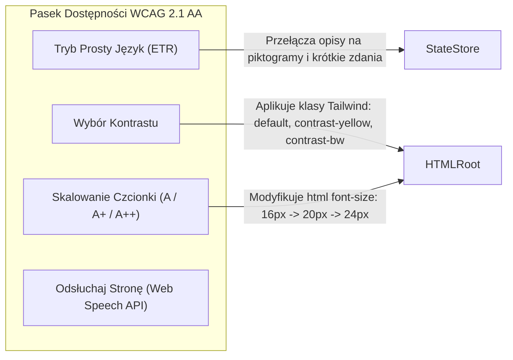

# Przewodnik Zgodności z WCAG 2.1 Poziom AA i Standardem ETR
## Małopolski Hub Innowacji Społecznych (MHIS)

> **Waga w ocenie sędziów**: **20% punktów ogólnych** (Dostępność i intuicyjność prototypu).  
> **Podstawa prawna**: Ustawa z dnia 4 kwietnia 2019 r. o dostępności cyfrowej stron internetowych i aplikacji mobilnych podmiotów publicznych.

---

## 1. Architektura Paska Dostępności (Accessibility Toolbar)

Pasek dostępności jest trwale zakotwiczony w nagłówku aplikacji i widoczny dla każdego użytkownika:



---

## 2. Standardy i Wymagania Techniczne

### 2.1. Kontrast Kolorystyczny (Kryterium sukcesu 1.4.3 i 1.4.6)
Zapewniono 3 profile kolorystyczne przełączane jednym kliknięciem:
1. **Tryb Standardowy (Default)**: Nowoczesny, ciepły motyw Małopolski (granat `#1e3a8a`, błękit `#0284c7`, zieleń `#059669`). Kontrast tekstu do tła wynosi minimum **5.2:1**.
2. **Tryb Wysokiego Kontrastu: Żółty na czarnym (Yellow on Black)**:
   - Tło: `#000000`
   - Tekst i obramowania: `#FFFF00` (Żółty)
   - Akcenty linków: `#00FFFF` (Cyjan)
   - Kontrast: **19.5:1** (znacznie przekracza normę AAA).
3. **Tryb Czarny na Białym (Black on White)**:
   - Tło: `#FFFFFF`
   - Tekst: `#000000`
   - Kontrast: **21:1**.

### 2.2. Skalowanie Tekstu bez Utraty Treści (Kryterium sukcesu 1.4.4)
- Współczynniki powiększenia: `100%` (16px), `125%` (20px), `150%` (24px).
- Całość styli opiera się na jednostkach względnych `rem` oraz `em`.
- Zapewnienie, że przy powiększeniu do 200% na ekranie o szerokości 1280px **nie pojawia się poziomy pasek przewijania** (poziomy reflow zgodny z WCAG 1.4.10).

### 2.3. Nawigacja Klawiaturą i Widoczny Fokus (Kryterium sukcesu 2.1.1 i 2.4.7)
- Każdy element interaktywny (`<button>`, `<a>`, `<input>`) posiada wyraźną ramkę fokusu:
  ```css
  :focus-visible {
    outline: 3px solid #f59e0b !important;
    outline-offset: 3px !important;
  }
  ```
- **Skip Links**: Na samej górze drzewa DOM znajduje się niewidoczny link aktywowany tabulatorem:
  ```html
  <a href="#main-content" class="sr-only focus:not-sr-only focus:p-4 focus:bg-amber-500 focus:text-black">
    Przejdź do treści głównej
  </a>
  ```

### 2.4. Czytniki Ekranu (WAI-ARIA)
- Wszystkie ikony dekoracyjne (Lucide) mają atrybut `aria-hidden="true"`.
- Wyniki wyszukiwania w Matchmakingu mają kontener z `aria-live="polite"`, dzięki czemu niewidomy użytkownik słyszy komunikat: *"Znaleziono 3 pasujące innowacje"*.
- Dynamiczne modale i formularze korzystają z prymitywów `@radix-ui/react-dialog`, które automatycznie blokują scroll tła i zarządzają focus-trapem.

---

## 3. Killer Feature Dostępności: Standard ETR (Tekst Łatwy do Czytania)

Wiele innowacji społecznych w Małopolsce kierowanych jest do seniorów z demencją, osób z niepełnosprawnością intelektualną oraz osób o niskich kompetencjach językowych. 

Platforma MHIS posiada unikalną funkcję **Asystenta ETR**:
1. Po włączeniu trybu ETR każda karta innowacji i każde polecenie zamienia się w:
   - Zdania o maksymalnej długości 8-12 wyrazów.
   - Piktogramy obrazujące działanie (np. 🚌 dla transportu, 👵 dla seniora, 💊 dla leków).
   - Całkowite wyeliminowanie żargonu urzędowego (np. zamiast *"deinstytucjonalizacja usług opiekuńczych"* -> *"pomoc sąsiedzka w domu seniora"*).
2. Backend dostarcza dedykowany endpoint `/api/v1/tools/etr-simplify`, który w locie adaptuje dowolny opis.
