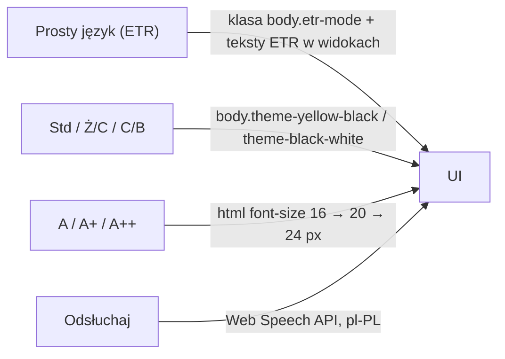

# Zgodność z WCAG 2.1 AA i standardem ETR
## Małopolski Hub Innowacji Społecznych (MHIS)

> **Waga w ocenie**: 20% (dostępność i intuicyjność prototypu).
> **Podstawa prawna**: ustawa z dnia 4 kwietnia 2019 r. o dostępności cyfrowej stron internetowych i aplikacji mobilnych podmiotów publicznych.
> **Stan**: prototyp **częściowo zgodny** – bez audytu eksperckiego i testów z czytnikami ekranu. Projekt deklaracji dostępności jest dostępny pod `/deklaracja-dostepnosci`.

---

## 1. Pasek dostępności

Wszystkie przełączniki mają `aria-pressed` i nazwy dostępne; ustawienia są zapamiętywane w `localStorage`. Tryb ETR jest domyślnie włączony.

---

## 2. Zrealizowane wymagania

| Kryterium | Realizacja |
|---|---|
| 1.1.1 Treść nietekstowa | ikony dekoracyjne z `aria-hidden`, przyciski-ikony z `aria-label` |
| 1.3.1 / 4.1.2 Etykiety pól | każde pole formularza ma `<label htmlFor>` lub `aria-label`; grupy radiowe w `<fieldset>`/`<legend>` (ankieta SUS, terminy mentorów) |
| 1.4.1 Użycie koloru | Mapa Wyzwań: wartość wskaźnika wpisana w każde pole kartogramu, legenda z zakresami, trend oznaczony strzałkami (▲/▼), miasta na prawach powiatu – przerywana ramka; statusy mają etykiety słowne |
| 1.4.3 Kontrast (minimum) | drobny szary tekst przyciemniony do min. `#64748b` (4,76:1 na białym), tekst na przyciskach amber – ciemny; tryb standardowy bez tekstu < 12 px na jasnym tle |
| 1.4.4 Zmiana rozmiaru tekstu | 100% / 125% / 150% (16 / 20 / 24 px), jednostki `rem` |
| 1.4.6 Kontrast (wzmocniony) | tryb żółty na czarnym (19,6:1) – **cały** interfejs, łącznie z linkami i przyciskami (bez cyjanu); elementy aktywne odwrócone (czarny na żółtym); tryb czarny na białym (21:1) |
| 1.4.10 Reflow | układ responsywny, menu mobilne zamiast poziomo przewijanej listy |
| 2.1.1 Klawiatura | karty kampanii i wątków to przyciski; pola mapy powiatów to przyciski (Tab + strzałki, Enter/Spacja) z własnym pierścieniem fokusu; zakładki z `role="tablist"` i strzałkami; ocena innowacji 1–5 to grupa przycisków radiowych w `fieldset` |
| 2.1.2 / 2.4.3 Okna dialogowe | `hooks/useDialog.ts`: `role="dialog"`, `aria-modal`, fokus w oknie, pułapka Tab, Escape zamyka, fokus wraca do wywołującego; okna nad nagłówkiem (`z-[60]`) |
| 2.3.3 Ruch | `prefers-reduced-motion` wyłącza animacje |
| 2.4.1 Pomijanie bloków | link „Przejdź do treści głównej” |
| 2.4.2 Tytuły stron | `document.title` ustawiany dla każdej trasy, strona 404 |
| 2.4.7 Widoczny fokus | `outline: 3px solid #f59e0b` dla `:focus-visible` |
| 3.3.1 / 3.3.3 Błędy | komunikaty walidacji z API wyświetlane przy formularzu (`role="alert"`), bez `alert()` |
| 4.1.3 Komunikaty o stanie | `aria-live` dla wyników Matchmakingu, liczby wyników wyszukiwania, wiadomości w wątkach i czacie (`role="log"`) |
| Alternatywa wykresu | tabela danych pod wykresem powiatów w Panelu ROPS i pod Mapą Wyzwań (wszystkie wskaźniki, przycisk „Pokaż szczegóły” dla każdego powiatu) |

---

## 3. Tekst łatwy do czytania (ETR)

- Każda innowacja ma streszczenie ETR (`etr_summary`) pokazywane na kartach i w karcie innowacji.
- Tryb ETR podmienia nagłówki i opisy wprowadzające modułów na prostsze wersje oraz zwiększa odstępy i ogranicza długość linii (`body.etr-mode`).
- `POST /api/v1/tools/etr-simplify` upraszcza dowolny tekst urzędowy.
- Formularze mają podpowiedzi prostym językiem, a Matchmaking przyjmuje opis mówiony (Whisper) – dla osób z trudnościami w pisaniu.

---

## 4. Znane ograniczenia i dalsze kroki

- brak audytu eksperckiego, testów z NVDA/VoiceOver i automatycznych testów axe-core/Lighthouse w CI,
- nie wszystkie teksty mają wersję ETR (dotyczy szczególnie wygenerowanych dokumentów),
- wydruki/PDF (wniosek, uchwała, raport) nie są otagowanymi dokumentami PDF,
- brak wersji językowych UA/EN.
