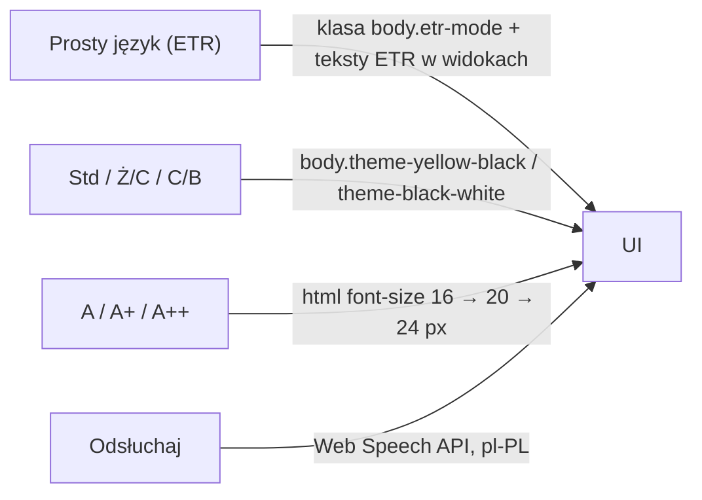

# Zgodność z WCAG 2.1 AA i standardem ETR
## Małopolski Hub Innowacji Społecznych (MHIS)

> **Waga w ocenie**: 20% (dostępność i intuicyjność prototypu).
> **Podstawa prawna**: ustawa z dnia 4 kwietnia 2019 r. o dostępności cyfrowej stron internetowych i aplikacji mobilnych podmiotów publicznych.
> **Stan**: prototyp **częściowo zgodny** – automatyczny audyt axe-core: 0 naruszeń na 18 widokach w 6 konfiguracjach (sekcja 4); bez audytu eksperckiego i testów z czytnikami ekranu. Projekt deklaracji dostępności jest dostępny pod `/deklaracja-dostepnosci`.

---

## 1. Pasek dostępności

Wszystkie przełączniki mają `aria-pressed` i nazwy dostępne; ustawienia są zapamiętywane w `localStorage`. Prosty język (ETR) jest zawsze włączony – nie ma przełącznika, żeby nikt nie trafił przypadkiem na trudniejszą wersję tekstu.

---

## 2. Zrealizowane wymagania

| Kryterium | Realizacja |
|---|---|
| 1.1.1 Treść nietekstowa | ikony dekoracyjne z `aria-hidden`, przyciski-ikony z `aria-label` |
| 1.3.1 / 4.1.2 Etykiety pól | każde pole formularza ma `<label htmlFor>` lub `aria-label`; grupy radiowe w `<fieldset>`/`<legend>` (ankieta SUS, terminy mentorów) |
| 1.4.1 Użycie koloru | Mapa Wyzwań: wartość wskaźnika wpisana w każde pole kartogramu, legenda z zakresami, trend oznaczony strzałkami (▲/▼), miasta na prawach powiatu – przerywana ramka; statusy mają etykiety słowne |
| 1.4.3 Kontrast (minimum) | drobny szary tekst przyciemniony do min. `#64748b` (4,76:1 na białym), tekst na przyciskach amber – ciemny; tryb standardowy bez tekstu < 12 px na jasnym tle |
| 1.4.4 Zmiana rozmiaru tekstu | 100% / 125% / 150% (16 / 20 / 24 px), jednostki `rem` |
| 1.4.6 Kontrast (wzmocniony) | tryb żółty na czarnym (19,6:1) – **cały** interfejs, łącznie z linkami i przyciskami (bez cyjanu); elementy aktywne odwrócone (czarny na żółtym); tryb czarny na białym (21:1) |
| 1.4.10 Reflow | układ responsywny, menu mobilne zamiast poziomo przewijanej listy |
| 2.1.1 Klawiatura | karty kampanii i wątków to przyciski; pola mapy powiatów to przyciski (Tab + strzałki, Enter/Spacja) z własnym pierścieniem fokusu; zakładki z `role="tablist"` i strzałkami; ocena innowacji 1–5 to grupa przycisków radiowych w `fieldset` |
| 2.1.2 / 2.4.3 Okna dialogowe | `hooks/useDialog.ts`: `role="dialog"`, `aria-modal`, fokus w oknie, pułapka Tab, Escape zamyka, fokus wraca do wywołującego; okna nad nagłówkiem (`z-[60]`) |
| 2.3.3 Ruch | `prefers-reduced-motion` wyłącza animacje |
| 2.4.1 Pomijanie bloków | link „Przejdź do treści głównej” |
| 2.4.2 Tytuły stron | `document.title` ustawiany dla każdej trasy, strona 404 |
| 2.4.7 Widoczny fokus | `outline: 3px solid #f59e0b` dla `:focus-visible` |
| 3.3.1 / 3.3.3 Błędy | komunikaty walidacji z API wyświetlane przy formularzu (`role="alert"`), bez `alert()` |
| 4.1.3 Komunikaty o stanie | `aria-live` dla wyników Matchmakingu, liczby wyników wyszukiwania, wiadomości w wątkach i czacie (`role="log"`) |
| Alternatywa wykresu | tabela danych pod wykresem powiatów w Panelu ROPS i pod Mapą Wyzwań (wszystkie wskaźniki, przycisk „Pokaż szczegóły” dla każdego powiatu) |

---

## 3. Tekst łatwy do czytania (ETR)

- Każda innowacja ma streszczenie ETR (`etr_summary`) pokazywane na kartach i w karcie innowacji.
- Tryb ETR podmienia nagłówki i opisy wprowadzające modułów na prostsze wersje oraz zwiększa odstępy i ogranicza długość linii (`body.etr-mode`).
- `POST /api/v1/tools/etr-simplify` upraszcza dowolny tekst urzędowy.
- Formularze mają podpowiedzi prostym językiem, a Matchmaking przyjmuje opis mówiony (Whisper) – dla osób z trudnościami w pisaniu.

---

## 4. Audyt automatyczny i klawiaturowy (G10, 2026-10-04)

**Metoda.** Skrypt Puppeteer + `axe-core` 4.x (reguły domyślne: WCAG 2.0/2.1 A i AA + dobre praktyki, m.in. kolejność nagłówków i regiony przewijane) uruchomiony na 18 adresach:
`/`, `/matchmaking`, `/matchmaking?q=…` (z wynikami), `/problemy`, `/baza-wiedzy`, `/baza-wiedzy?tab=mapa`, `/baza-wiedzy/rops-inn-001` (karta innowacji), `/kreator-pomyslow`, `/middleman`, `/tester`, `/dialog`, `/moje-sprawy`, `/powiadomienia`, `/status/<id>`, `/otwarte-dane`, `/admin` (logowanie), `/deklaracja-dostepnosci`, strona 404.
Każdy adres w 6 konfiguracjach: kontrast standardowy, Ż/C, C/B (1280 px), telefon 390 px, telefon 320 px (WCAG 1.4.10) i 390 px przy tekście 150%. Dodatkowo pomiar przewijania w poziomie (`scrollWidth > innerWidth`) i przejście klawiszem Tab po każdej stronie (czy każdy element jest osiągalny, ma nazwę i widoczny fokus, czy nie ma pułapek).
Narzędzia nie są zależnością projektu – uruchamiane z osobnego katalogu roboczego.

**Wyniki (liczba węzłów z naruszeniem; „przed” = `dev@b156822`, „po” = gałąź `dev-e`).** Trasy niewymienione: 0 przed i po we wszystkich konfiguracjach.

| Widok | Naruszenie (axe) | Waga | Przed | Po |
|---|---|---|---|---|
| `/baza-wiedzy/<id>` | `definition-list`, `dlitem` – `<dt>/<dd>` zagnieżdżone w dodatkowym `
` | poważne | 9 × 6 konfig. = 54 | 0 |
| `/dialog` | `listitem` + `aria-allowed-role` – `role="log"` na `<ol>` | poważne + drobne | 2 × 6 = 12 | 0 |
| `/otwarte-dane` (telefon) | `scrollable-region-focusable` – przykład kodu przewijany myszą, nie klawiaturą | poważne | 3 | 0 |
| `/middleman` (tekst 150%) | `scrollable-region-focusable` – rozmowa z doradcą | poważne | 1 | 0 |
| `/middleman` | `heading-order` – h3 zaraz po h1 | umiarkowane | 1 × 6 = 6 | 0 |
| `/tester` | `heading-order` – karty pomysłów (h3) bez h2 | umiarkowane | 1 × 6 = 6 | 0 |
| wszystkie 18 (320 px) | przewijanie w poziomie o 56 px (logo + przycisk Menu w nagłówku) | 1.4.10 | 18 | 0 |
| wszystkie 18 (390 px, tekst 150%) | przewijanie w poziomie o 173 px (nagłówek, karty, zakładki Testera, długie nagłówki) | 1.4.10 | 18 | 0 |

Razem (6 konfiguracji): **przed** 82 węzły z naruszeniem axe (0 krytycznych, 64 poważne, 12 umiarkowanych, 6 drobnych) + 36 przypadków poziomego przewijania; **po** 0 i 0.
Kontrast: axe nie znalazł błędów w żadnym trybie; jedyny niesprawdzalny element to pole „Twoja sprawa” na stronie głównej (tło w linie – sprawdzone ręcznie: tekst `slate-900` na bieli).

**Klawiatura – sprawdzone ścieżki.**
- Matchmaking: Enter w polu opisu dodaje nową linię (tekst zostaje), wysyła przycisk „Znajdź innowację” lub Ctrl+Enter; po wyniku fokus na podsumowaniu; Tab → „Szczegóły” → karta innowacji (fokus w oknie, 40 × Tab bez wyjścia poza okno) → Escape wraca **do tych samych wyników** z fokusem na linku, który otworzył kartę (zapytanie zapisane w adresie).
- Tester: zakładka „Pilotaże” → karta pilotażu → „Zgłoś się na testy” → okno z fokusem na pierwszym polu, Escape zamyka.
- Dialog: lista wątków → wątek (historia wiadomości przewijana klawiaturą) → podpis, rola, treść → „Wyślij”.
- Kreator: wszystkie 50 elementów osiągalnych Tabem, bez pułapek.
- Mapa Wyzwań: pola powiatów jako jedna grupa (Tab wchodzi raz, strzałki przesuwają) – stąd mniej przystanków Tab niż elementów.

**Poprawki komunikatów (G12).** Błędy walidacji z API były pokazywane surowo po angielsku (np. `author_email: String should match pattern '^[A-Za-z0-9._%+-]+@…'`). Teraz każde pole ma polską nazwę z formularza i zdanie „co poprawić” (`backend/app/core/validation_messages.py`, test `test_validation_messages.py`), np. „Pole „Tytuł” jest za krótkie – wpisz co najmniej 3 znaki.”, „Wpisz poprawny adres e-mail, np. jan.kowalski@poczta.pl.”. Frontend rozpoznaje też przekroczony czas, 429, 413 i błąd serwera bez opisu. W Testerze błędy wczytywania i głosowania trafiały do zielonego pola „sukces” – teraz czerwone pole `role="alert"`; dodane stany „Wczytywanie…” i puste stany (brak wyników filtra, brak pilotaży, brak wątków w Dialogu).

---

## 5. Znane ograniczenia i dalsze kroki

- brak audytu eksperckiego i testów z NVDA/VoiceOver; audyt axe uruchamiany ręcznie, nie w CI,
- axe sprawdza ok. 30–40% kryteriów WCAG – reszta (np. zrozumiałość treści, kolejność czytania w oknach generowanych przez AI) wymaga oceny człowieka,
- nie wszystkie teksty mają wersję ETR (dotyczy szczególnie wygenerowanych dokumentów),
- wydruki/PDF (wniosek, uchwała, raport) nie są otagowanymi dokumentami PDF,
- brak wersji językowych UA/EN.
