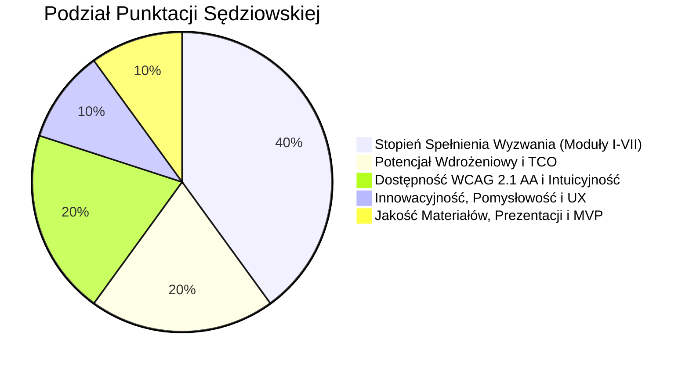

# Strategia Zwycięstwa w Hackathonie (100/100 Pkt)
## Małopolski Hub Innowacji Społecznych – ROPS Kraków

> **Cel**: Zdobycie maksymalnej oceny sędziów z Regionalnego Ośrodka Polityki Społecznej w Krakowie oraz jurorów technologicznych HackYeah poprzez precyzyjne zaadresowanie każdego kryterium regulaminu.

---

## 1. Dekonstrukcja Kryteriów Oceny (Zgodnie z Regulaminem)

### 1.1. Kryterium I: Stopień Spełnienia Wyzwania – Waga: 40%
- **Zasada punktowania**: Moduł obligatoryjny (Matchmaking) = 10%. Każda kolejna zrealizowana funkcjonalność = +5%.
- **Nasza realizacja (100% punktów w tej kategorii = 40/40 pkt)**:
  1. **Moduł I (Obligatoryjny)**: Matchmaking społeczny RAG (10 pkt)
  2. **Moduł II**: Zasobnik wiedzy z bazą innowacji ROPS i Mapą Wyzwań (+5 pkt)
  3. **Moduł III**: Kreator pomysłów (Fiszka, Wniosek grantowy, Canwa Innowacji, Asystent AI) (+5 pkt)
  4. **Moduł IV**: Tester innowacji z dziennikiem feedbacku i metrykami SUS (+5 pkt)
  5. **Moduł V**: Platforma aktywnej komunikacji i partnerstw międzysektorowych (+5 pkt)
  6. **Moduł VI**: Panel administratora z moderacją i Radarem Trendów ROPS (+5 pkt)
  7. **Moduł VII**: Middleman Innowacji – asystent adaptacji innowacji do usług JST (+5 pkt)
  *Suma: 10% + (6 x 5%) = 40% (Maksymalna możliwa ocena bazowa)*.

---

### 1.2. Kryterium II: Potencjał Wdrożeniowy i Efektywność – Waga: 20%
Jurorzy szukają produktów **nadających się do natychmiastowego wdrożenia**, skalowalnych, o minimalnym koszcie utrzymania (TCO).

#### Jak przekonujemy jurorów?
1. **Gotowość produkcyjna (Production-Ready Architecture)**:
   - Konteneryzacja Docker & Docker Compose (uruchomienie 1 poleceniem `docker compose up`).
   - Czysty podział: FastAPI (Python) + React (TypeScript) + baza danych z migracjami.
   - Brak "vendor lock-in": system działa zarówno z darmowymi modelami lokalnymi (Ollama / HuggingFace Transformers / FAISS), jak i chmurowymi (OpenAI / Google Gemini / Azure).
2. **Kalkulacja TCO (Total Cost of Ownership) dla Samorządu Województwa Małopolskiego**:
   - Miesięczny koszt hostingu w polskiej chmurze (np. Chmura Krajowa OChK / OVHcloud Polska): **ok. 90-140 PLN netto / miesiąc**.
   - Koszt API LLM przy 10 000 zapytań/miesiąc (zoptymalizowany RAG z embeddingami lokalnymi): **ok. 25-40 PLN / miesiąc**.
   - Wdrożenie wewnętrzne (serwery Urzędu Marszałkowskiego): **0 PLN kosztów licencyjnych** (100% open-source stack).
3. **Bezpieczeństwo i RODO (Zgodność z wytycznymi konkursu)**:
   - Żadne prawdziwe dane wrażliwe mieszkańców nie trafiają do modeli zewnętrznych.
   - Wbudowany mechanizm syntetyzacji i anonimizacji zgłoszeń przed wejściem do wektoryzacji.

---

### 1.3. Kryterium III: Dostępność i Intuicyjność (WCAG 2.1 AA) – Waga: 20%
ROPS kładzie nacisk na seniorów, osoby z niepełnosprawnościami oraz mieszkańców o niskich kompetencjach cyfrowych.

#### Kluczowe elementy decydujące o wygranej (Killer Features WCAG):
1. **Tryb "Prosty Język" (Easy-to-Read / ETR)**:
   - Jeden przycisk na pasku narzędzi zamienia urzędniczy żargon karty innowacji czy formularza w prosty tekst z piktogramami, zrozumiały dla osób starszych i z niepełnosprawnością intelektualną.
2. **Zaawansowany Pasek Dostępności**:
   - Tryby wysokiego kontrastu: *Żółty na czarnym*, *Czarny na białym*, *Wysoki kontrast ciemny*.
   - Płynny zoom fontów (100%, 125%, 150%, 175%) bez ucinania tekstu ani horyzontalnego paska przewijania.
   - Odstępy między liniami i wyrazami zgodne z wytycznymi WCAG 1.4.12.
3. **Nawigacja z klawiatury i Screen Reader Ready**:
   - Widoczny, gruby indykator fokusu (`outline: 3px solid #f59e0b`).
   - Skip links (`Przejdź do treści głównej`).
   - Poprawne atrybuty `aria-label`, `aria-live` dla wyników wyszukiwania RAG.

---

### 1.4. Kryterium IV: Kryteria Premiujące – Waga: 20%
- **Atrakcyjność, pomysłowość i UX (10%)**:
  - *Interaktywna Mapa Wyzwań Małopolski*: wizualizacja 22 małopolskich powiatów w SVG/Canvas z warstwami zapotrzebowania, zrealizowanych innowacji i wskaźników demograficznych.
  - *Wizualizator AI Przedmiotów Innowacyjnych*: w Kreatorze Pomysłów użytkownik opisujący prototyp (np. "specjalne krzesło sensoryczne") otrzymuje podgląd wizualny i schemat techniczny wygenerowany w czasie rzeczywistym.
- **Jakość Materiałów i Prezentacji (10%)**:
  - Gotowa 10-slajdowa prezentacja (PDF) z metrykami wdrożeniowymi.
  - Wyczerpujące makiety UI/UX i klikalne demo.
  - Dane demonstracyjne oparte na realnych innowacjach ROPS (np. *Mobilny Doradca Seniora*, *Łazienka Modularna*, *koMIX życiowy*, *Terapeuta Przestrzeni*).

---

## 2. Zestawienie Naszych "Killer Features"

| Killer Feature | Dlaczego zachwyci jury ROPS? | Gdzie w aplikacji? |
|---|---|---|
| **Middleman Innowacji (AI Service Blueprint)** | Rozwiązuje największą bolączkę ROPS: setki gmin nie wiedzą, JAK wdrożyć innowację. System generuje dla wybranej gminy gotowy wzór uchwały, kalkulację etatów i harmonogram wdrożenia! | Moduł VII (`/middleman`) |
| **Pasek ETR (Tekst Łatwy do Czytania)** | Prawdziwa inkluzywność społeczna w praktyce. Seniorzy i osoby wykluczone cyfrowo czują się zaopiekowane. | Pasek górny (Globalny) |
| **Cyfrowa Canwa Innowacji z Mentorem AI** | Przekształca chaos myślowy mieszkańca w profesjonalny 9-polowy model innowacji społecznej ROPS. | Moduł III (`/kreator`) |
| **Radar Trendów Powiatowych** | Dyrektor ROPS widzi w czasie rzeczywistym, w których powiatach rośnie problem samotności czy wykluczenia transportowego. | Moduł VI (`/admin`) |
| **Zero-Lag Hybrid Matchmaker** | Łączy wyszukiwanie wektorowe i pełnotekstowe w ułamku sekundy, podając wyjaśnienie dopasowania w 2 zwięzłych zdaniach. | Moduł I (`/matchmaking`) |

---

## 3. Scenariusz Prezentacji Finałowej (Pitch Deck - 3 Minuty)

1. **Minuta 0:00 - 0:45: Problem i Misja Małopolski**:
   - Pokazanie Mapy Wyzwań: starzejące się powiaty wschodnie vs dynamiczny wianuszek krakowski. Setki innowacji ROPS, które leżą w szufladach, bo gminy nie potrafią ich wdrożyć, a mieszkańcy nie wiedzą o ich istnieniu.
2. **Minuta 0:45 - 1:45: Live Demo (Ścieżka Mieszkańca i Samorządu)**:
   - Mieszkaniec mówi językiem potocznym: *"Moi starzy rodzice w gminie Lipnica Wielka nie mają jak kupić leków"*.
   - System Matchmakingu natychmiast kojarzy problem z innowacją *"Mobilny Doradca Seniora"* i *"Sąsiedzki Wolontariat Lekowy"*.
   - Przełączenie w tryb ETR (duża czcionka, piktogramy).
   - Wejście w **Middlemana Innowacji**: Wójt Gminy klika *"Wdróż w Lipnicy Wielkiej"* -> AI generuje pakiet wdrożeniowy z kalkulacją kosztów.
3. **Minuta 1:45 - 2:30: Zaplecze ROPS (Radar Trendów i Admin)**:
   - Panel analityczny dla pracowników ROPS: agregacja potrzeb, wykres trendów, moderacja fiszek.
4. **Minuta 2:30 - 3:00: Architektura, TCO i Gotowość do Wdrożenia**:
   - Kontenery Docker, 100% open source, koszt utrzymania < 100 zł/mc, pełna zgodność z WCAG 2.1 AA.
   - Pytanie zamykające: *"Jesteśmy gotowi podpiąć platformę pod domenę rops.krakow.pl w 48 godzin"*.
